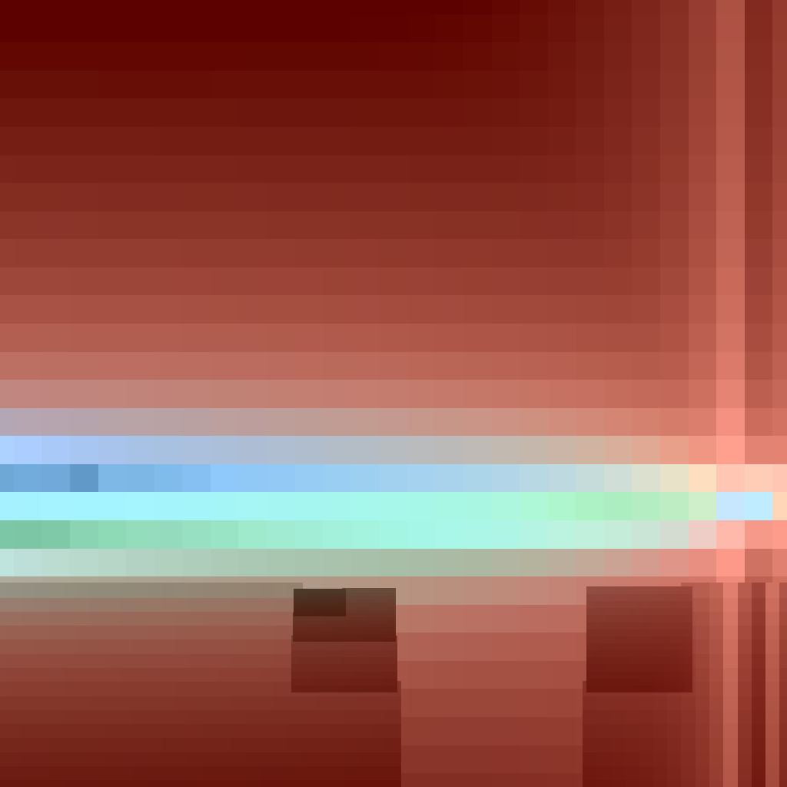
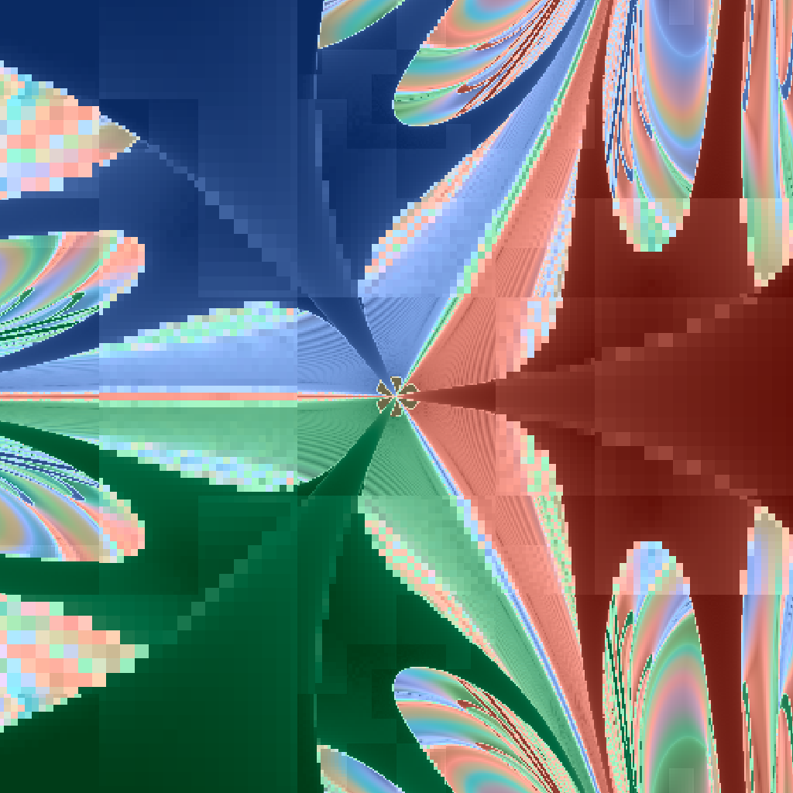
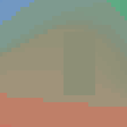
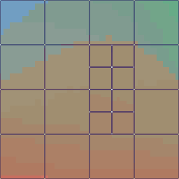
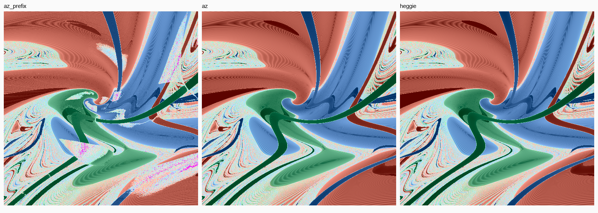

<h1 align="center">prin-rs</h1>

<p align="center">
  
</p>

<p align="center"><i>Every pixel is a three-body simulation. The picture is where they disagree.</i></p>

A Rust kernel that renders slices of three-body initial-condition space. Release three bodies from
rest, integrate to a playhead `t`, ask what happened — collision, escape, still bound — and colour
the pixel by it. Do that a million times.

The interesting part is not the picture. It is that **the picture is a chaos instrument**: each
pixel carries an ensemble of perturbed copies, and what the renderer actually draws is *how much
they disagree*. Smooth where the dynamics are tame, shredded where they are not, and the boundary
between those is fractal at every scale you can afford to compute.

**The physics is the product. The image is a diagnostic.**

---

## What is in here

Three regularised integrators, a refinement scheduler that decides where to spend compute, and
about nine months of measurements arguing with each other.

| | |
|---|---|
| **[`FINDINGS.md`](FINDINGS.md)** | **start here** — the coherent account: what was measured, what it overturned, what the machinery settled into |
| [`BRIEF.md`](docs/BRIEF.md) | the authoritative spec — the system, the slice, the integrator, every per-pixel field and why it exists |
| [`CLAUDE.md`](CLAUDE.md) | the working agreement, and the findings record in discovery order |
| [`RESULTS.md`](docs/RESULTS.md) · [`NOTES.md`](docs/NOTES.md) | per-experiment tables and the mechanisms behind them |
| [`results/README.md`](results/README.md) | every committed artefact, with the command that made it |

---

## The instrument

One pixel is one simulation — but a *single* trajectory tells you nothing about whether it can be
trusted. So each pixel carries `E+1` copies, jittered inside its own cell, and the field being
drawn is their disagreement.

<p align="center">
  
  
  
</p>

Hue is the final configuration on the shape sphere; lightness is the ensemble spread. Flat colour
means the copies agreed — the dynamics there are predictable. Texture means they did not.

The copies use a **fixed Halton (2,3) prefix indexed by copy index**, not a per-pixel random stream.
Copy `k` sits at the same offset in every cell at every refinement level, so a parent and its
children are compared under common random numbers by construction. That drops the per-quad noise
floor from 0.4796 to **0.0010**, and parent/child correlation rises to **0.9998**.

It does not buy as much as it should. Sampling noise is only ~7% of the scatter in the refinement
exponent — the other 93% is chaotic divergence, and **no number of copies buys that off.**

---

## The playhead

The same slice, marched forward in time. No tree, no scheduler — one full render per sync boundary.

<p align="center"></p>

Structure that looks like noise at one horizon is often a *phase*: neighbouring initial conditions
running the same trajectory shifted in time. Measured on one ribbon — best-lag correlation
**0.9999–1.0000**, with the lag growing linearly. A frequency beat between two slightly different
binary periods, not a divergence. **One slice holds both regimes**, and the criterion cannot tell
them apart while two trajectories and a correlation can.

### What `t` actually is

`G = 1`, and the scale symmetry is quotiented out — so a slice is every scale at once and `t` has
no duration in seconds until you pin one. What it measures is the system's own **crossing time**:
on the latent charts total mass is 1 and the hyperradius is 1 by algebraic identity, so `t = 1` is
exactly one crossing time and the animation above is **52 of them**.

Pin a mass and a length and it converts, `τ = √(R³ / G M)`:

| pin it to | `t = 1` | `t = 52` |
|---|---|---|
| 1 M☉ total, R = 1 AU | 58.1 days | **8.3 years** |
| 3 M☉, R = 10 AU | 2.9 years | **151 years** |
| 2 M☉, R = 20 AU (α Cen-ish) | 10.1 years | **523 years** |
| 3 M☉, R = 100 AU (wide triple) | 92 years | **4 780 years** |
| Earth–Moon masses, R = 400 000 km | 4.6 days | **8 months** |
| 3 M☉, R = 1000 AU (cluster core) | 2 900 years | **151 000 years** |

Burrau's problem in the repo's own units (`M = 12`, `R = 2.2361`) has a crossing time of **0.965**,
so the `t = 13` horizon is about 13.5 of them. The animation runs 0.05 `t` per frame at 30 fps, so
one second of playback is **1.5 crossing times**.

---

## The refinement scheduler

Rendering a million pixels at full depth is not the goal — spending a budget well is. A quadtree
descends the slice, and each quad decides for itself whether splitting buys anything.

<p align="center">
  
  
</p>

<p align="center"><i>the adaptive render, and the tree that produced it — always draw both</i></p>

The wireframe is not decoration. A coarse texel tells you a leaf is coarse; only the wire tells you
whether the tree subdivided *around* a structure or straight *through* it. A bad tree survived a
whole build unnoticed because boundaries were drawn over a uniform base.

### How it decides

**Split iff any footprint in the quad is unresolved.** No exponent in the split test:

```
unresolved(f)  ⟺  spread_shape(f) > eps          the payload has not settled
               ∨  the copies disagree on event class
               ∨  the footprint is undetermined
```

That is it for the split rule. The subtlety is all in knowing when to *stop*, because a fractal
region is unresolved at every level and would descend forever. The stop is an exponent on the
quantity the policy actually optimises:

```
alpha_area = log2( unresolved_area(coarse) / unresolved_area(children) )
```

A line reads **1**, a sea reads **0**, a boundary of box dimension `d` reads **2 − d** — so the
threshold is a *dimension* threshold. A quad floors only when a split buys no area **and** the spread
exponent is flat, judged over two levels rather than one (a thin structure on a quad boundary is
shared by both parents at half weight, and a one-level exponent is off by a factor of two in both
directions).

Noise is told from structure by neighbour agreement: an unresolved footprint is structure iff two of
its eight neighbours share its class and land within ~11° on the shape sphere. A sea's neighbours are
independent draws, so agreement by chance is a few in ten thousand.

<details>
<summary><b>Why the previous criterion was inverted, and why no error curve noticed</b></summary>

The original policy split where `alpha = log2(spread_parent/spread_child)` was **large** — that is,
where halving the cell had already halved the spread. That is the *smooth* regions. It floored
exactly the discontinuities and fractal mixing it existed to find.

It survived because every `error(B)` curve scored OKLab distance under the shipping colouring, whose
lightness is auto-ranged to each region's own p1–p99. A smooth region's `1e-8` residual counted as
error at every depth, so breadth-first came out near-optimal **by construction of the metric**.

Scored on the payload instead — nominal shape and event class against a fixed tolerance in the
spread's own units — `near-field` reaches zero unresolved at **137 quads** against uniform's 5449.
</details>

<details>
<summary><b>Four things stop a descent, and only one of them is the criterion</b></summary>

| stop | what it means |
|---|---|
| `ScreenFloor` | the quad's texels are below display resolution — a **veto, never a trigger** |
| `MaxLevel` | a depth cap |
| `BudgetExhausted` | the budget ran out |
| the criterion | `Keep`, `Floor`, `Undetermined`, `Collapsed` |

Measured across the corpus, the camera veto stops **≥95% of leaves on 21 of 69 dumps** and the budget
up to 91%. For most of this project's history every leaf count was quoted as a criterion decision.
**Never quote a leaf count without its stop-reason breakdown.**
</details>

<details>
<summary><b>Ranking, and what "beats random" is worth</b></summary>

Under a budget the frontier is ranked and truncated to `k_frac`. Three reference points, and the
names matter: **floor** = a five-seed random band, **reference** = `greedy_lookahead_1`, **ceiling** =
`dp_optimal`, the exact minimum over all tree-shaped leaf sets (cheap — 5461 splits in 0.01–0.03 s).

Greedy is **not** a bound, and the old name `greedy_oracle` cost two PRs: on `far` it reads 0.54760
against a random band of 0.48550–0.52047, the worst strategy in the table.

Neither is random the bar. Against **breadth-first**, which was missing from every table in the
corpus, most standing comparisons change sign — and on a smooth field, ranking by spread *is*
breadth-first, because a quad of width `w` over a gradient `g` has variation `~g·w`. So a featureless
region degenerating to uniform is **correct behaviour**, not a failure.
</details>

---

## Regularisation

Close approaches make `1/r²` unbounded, so every integrator here uses a coordinate transformation
plus a time transformation. Three are implemented and the differences are not academic:

<p align="center"></p>

<p align="center"><i>the same slice, before and after the step-control work</i></p>

| | |
|---|---|
| **Aarseth–Zare** | two pairs regularised about a **reference body**, re-chosen every sync boundary. Cross-checked against the NumPy reference at `0.000e+00` over all 32 points — the only integrator here with an independent implementation |
| **Heggie** | global: all three pairs at once, **no reference body**, so the state is never re-registered mid-run. **The default** |
| **logH** | chartless — a logarithmic-Hamiltonian time transformation and no coordinate map. Loses by 29× to 215,000× |

Heggie wins **31 of 32 cases**, and `err>10` — the flag for *this pixel is not data* — runs **3915
against 74** across the gallery. But the whole-frame median shows **1.14×**, because two opposite
effects are spatially separated: conditioned on AZ's own worst drift decile, Heggie fixes **100% of
those pixels by a median 1900×**, while losing ~16× where drift is already `1e-10`.

**The default is not justified by the scoreboard.** A default justified by a win count does not
survive the next investigation. It is justified by the mechanism: no reference body means no
re-registration, and re-registration is what makes AZ spatially discontinuous — neighbouring pixels
that switch reference at different boundaries diverge. Measured unconfounded, `AZ chord 5.162e-1`
against `HG 4.832e-2`, **10.7×**, with three guards proving the null was not the instrument.

<details>
<summary><b>logH losing does not settle it — and that matters</b></summary>

logH was built as the falsification test: if Heggie's advantage is *no re-registration*, a method
with no reference body should inherit it. It loses decisively, and that establishes nothing, because
logH differs from Heggie in **two** ways — no re-registration *and* no coordinate transformation.

The second is fatal here. logH reaches `d_min < 1e-10` and **never** `|dE/E| < 1e-12`, its drift
*rising* with penetration depth where Heggie's regularised drift is flat at `4.4e-15`. A KS map
removes the `1/r` from the Hamiltonian; a time transformation only slows the clock. Every region
tested is collision-dominated, so logH was graded almost entirely on the one thing it cannot do.

**A chartless method is not a coordinate regularisation with the coordinates left out.**
</details>

---

## Step control

The visible artefacts turned out to live here, not in the integrator.

A single RK4 step was advancing the physical clock by **2.209e128** against a sync interval of 0.4 —
finite, so the guard passed, and satisfying the landing test by 128 orders, so the march recorded a
**clean landing**. An unbounded step with no acceptance test, invisible in every recorded quantity.

The cure is one divide, from values the derivative call already returns:

```
dτ  ≤  f · d_min / ( |v_rel|_max · A · B )        f = 0.02
```

A pericentre-resolution condition — Rauch & Holman quote `T_p/20` for step-size resonance overlap in
the Wisdom–Holman mapping; this ships at 1/50. Measured: `error_ratio` p99 **7.108e9 → 1.109**,
overshoot count **634 → 0**, for **+1.9% of the steps**.

Three fixes, ablated one at a time, doing three different jobs:

| arm | non-finite | wedge density |
|---|---|---|
| none | 1153 | 0.0026 |
| `dtau` only | 32 | 0.0026 |
| clamp only | **1531** | 0.0024 |
| limit only | **0** | **0.0001** |
| all three | 0 | 0.0001 |

The step limit alone reproduces all three. The `dτ` fix removes the *magenta* and leaves the wedges
untouched — **two artefacts, never one defect** — and the clamp alone makes things worse, while being
unremovable regardless because it takes the marched convergence order from **1.06 to 2.08**.

<details>
<summary><b>The live-playhead criterion — the test every remedy has to pass</b></summary>

The target design marches trajectories forward and renders as it goes. At playhead `t` the only
things known are the initial conditions and the trajectory up to `t`. So:

> Could this decision be made by a trajectory that has only reached `t`, without re-running it from
> `t = 0` and without knowing anything after `t`?

The predictive step limit, per-step `dτ` sizing, the landing clamp and a bounded confirmation lag all
pass. **`refine_flagged` does not** — it re-integrates a whole trajectory from `t = 0` after seeing
its error, and a pixel bad at `t = 30` cannot be repaired at `t = 30.1` without redoing thirty time
units. Neither does any rule keyed on `t_end`, or any two-pass render.

And there is a third category that is easy to miss: **live-compatible and still not a fix.** A
per-pixel dither of the step phase would break a spatial beat by decohering it, and passes the
criterion cleanly — while converting a *coherent* artefact into *incoherent noise of the same
amplitude*. It removes the evidence rather than the error.
</details>

---

## Running it

```bash
cargo build --release
cargo run --release --bin prin -- --region near-field --size 256 --out out
```

Writes `out.raw` (the product — every per-pixel field), `out_outcome.png` and `out_spread.png`.
`--help` lists the rest; the flags that change *what is measured* rather than how much are
`--precision f32`, `--shared-reference`, `--r-coll`, `--escape-rule`, `--dtau-mode` and
`--no-refine`.

```bash
cargo test --release                      # invariants and the acceptance suite
cargo test --release -- --ignored         # plus the NumPy cross-check (needs python3 + numpy)
```

Every measurement in `RESULTS.md` has a harness under `examples/` that prints its own raw table, and
every committed artefact in `results/` carries a `.cfg.txt` sidecar naming the exact kernel that
produced it.

<details>
<summary><b>Layout</b></summary>

| path | contents |
|---|---|
| `src/` | the kernel — integrators, ensemble, scheduler, colouring, output |
| `examples/` | one harness per measurement; each prints its own raw table |
| `results/` | committed panels, dumps and captured output, each with a provenance sidecar |
| `reference/` | the validated NumPy implementation. Port it; do not re-derive the algebra |
| `tools/` | the cross-check harness, corpus verification, format conversion |
</details>

---

## The one habit worth stealing

Most findings in `FINDINGS.md` are corrections, and nearly all of them were caught the same way.

> **A test that cannot fail is indistinguishable from a test that passes.**

Ask what would have to be true for the test to fire. A label-flip count of zero where every pixel
collides anyway is saturated, not clean. An invariance test at a horizon where nothing has terminated
is measuring its own arithmetic. An accounting identity that telescopes for *any* ranking — random
numbers included — reports PASS and means nothing; it was proposed as the fix.

The same shape, one level up: **never conclude "no effect" from an aggregate without the per-pixel
distribution.** Four sites here, one of them inside the run written to *confirm* the prediction — a
median of exactly `0.000` while **37% of a million pixels moved, the worst by a third of the shape
sphere's diameter**.

And: **a statistic can report maximum confidence precisely when it is least informed.** A collapsed
decode gives a spread of exactly zero, which reads as *perfectly resolved*. A footprint whose every
copy died early reads its error ratio at exactly `1.0000` — the converged value — because they all
stopped at the same point and so agree perfectly. Ask what a statistic would say about a system
nothing is known about; if the answer is "confident", it is wrong.
