<h1 align="center">prin-rs</h1>

<p align="center">
  
</p>

<p align="center"><i>
One slice of three-body initial-condition space, marched from <code>t = 0</code> to <code>t = 23</code>.
1024², one full simulation per pixel per frame.
</i></p>

A Rust kernel for rendering slices of the three-body problem's initial-condition space. Each pixel
is an independent simulation: decode the pixel's coordinates into a three-body initial condition,
integrate it under a regularised scheme to a playhead time `t`, and colour the pixel by the state
it reached. A 1024² frame is 1,048,576 simulations.

The renderer does not draw a trajectory. It draws a **statistic over an ensemble of trajectories**,
and the choice of statistic is what makes the image a measurement rather than a picture.

---

## Contents

| | |
|---|---|
| **[`FINDINGS.md`](FINDINGS.md)** | the coherent account — what was measured, what it overturned, what the machinery settled into |
| [`docs/BRIEF.md`](docs/BRIEF.md) | the specification: the system, the charts, every per-pixel field and why it exists |
| [`CLAUDE.md`](CLAUDE.md) | the working agreement, and the findings record in discovery order |
| [`docs/RESULTS.md`](docs/RESULTS.md) · [`docs/NOTES.md`](docs/NOTES.md) | per-experiment tables and mechanisms |
| [`results/README.md`](results/README.md) | every committed artefact, with the command that produced it |

---

## 1. What is being computed

### The system

Three point masses under Newtonian gravity in a plane, released **from rest**, with `G = 1`.
Released from rest means zero initial angular momentum, so the dynamics stay planar and `L_z = 0`
identically — a fact that matters later, because it rules out an entire class of diagnostic.

The equations of motion are integrated in a **regularised** coordinate system rather than directly:
close approaches make the `1/r²` force unbounded and a direct integrator either takes vanishing
steps or produces nonsense. Section 5 covers which regularisations are implemented and how they
compare.

Two scale symmetries are quotiented out. The overall size of the configuration and the total mass
can be absorbed into a rescaling of length and time, so a slice is not one system at one scale — it
is an equivalence class of systems at every scale simultaneously. This is why `t` has no duration in
seconds until a mass and a length are pinned (section 4), and why the collision radius `r_coll` and
the softening `epsilon` are expressed as fractions of the initial hyperradius `R`, evaluated once at
`t = 0` and **never co-moving**. A co-moving length makes the Hamiltonian time-dependent and
destroys energy conservation; an absolute length breaks the scale invariance and gives the same
physical system two different answers depending on an arbitrary choice of units — measured, a factor
of 1.66.

### What a pixel is

A **chart** is a 2-plane through a higher-dimensional space of initial conditions. Several are
implemented:

- `BodyPlane` — hold two bodies fixed, sweep the position of the third. The classical picture.
- `Latent` — a 10-dimensional latent encoding in which the plane's two axes are chosen from
  configuration coordinates (`alpha`, `beta`: the shape of the initial triangle), momentum
  coordinates (`p_rho`, `p_lambda`), or mass logits. Ported from a GLSL reference implementation;
  the decoder's index table is pinned against it.
- `BurrauFamily`, `mass_simplex`, `invariant_lz_k` — families parameterised by a conserved quantity
  or a mass ratio.

A pixel's `(u, v)` position in the plane is decoded into a full initial condition: three positions,
three masses, three momenta. **Which coordinates the chart varies matters more than where it is
centred** — two charts sharing a base point exactly, one sweeping configuration and one sweeping
momentum, differ 5.7× in the amount of structure they contain.

### What is recorded

Each trajectory is integrated to `t_max`, with the Cartesian state sampled at `n_sync` sync
boundaries. Per trajectory the kernel records the terminal state and its time, the closest approach
`d_min` over the whole run, the energy drift `|dE/E|`, the step count, and the shape of the final
configuration. Termination is by one of two rules, both transcribed from the reference:

- **collision** — a pair closes below `r_coll`. Sampled *inside* the integrator loop, so it carries
  step resolution. Two or more pairs below `r_coll` is a triple, encoded separately; by the triangle
  inequality "exactly two pairs" is reachable and is already a near-triple, so requiring all three
  would silently misclassify it.
- **escape** — the default rule is a *closure* criterion transcribed from the reference: the
  direction to the escaping body stops changing over a window **and** its relative energy is
  positive. Sampled only where the state is Cartesian, i.e. at sync boundaries.

`d_min` is primary and the collision label is derived from it. `r_coll` is a recorded parameter, not
a physical constant: across `r_coll/R ∈ {1e-4, 1e-3, 1e-2}` the collision fraction runs
0.0000 → 0.0242 → 1.0000 while the grid's own `d_min/R` spans less than one decade. No threshold in
that range is a physical event boundary, so `r_coll` appears in every output header and the default
claims only that it separates tail from bulk on the slices measured.

<details>
<summary><b>The charts, and why <i>which</i> coordinates a plane varies matters more than where it is centred</b></summary>

<p align="center">
  
  
  
  
</p>
<p align="center">
  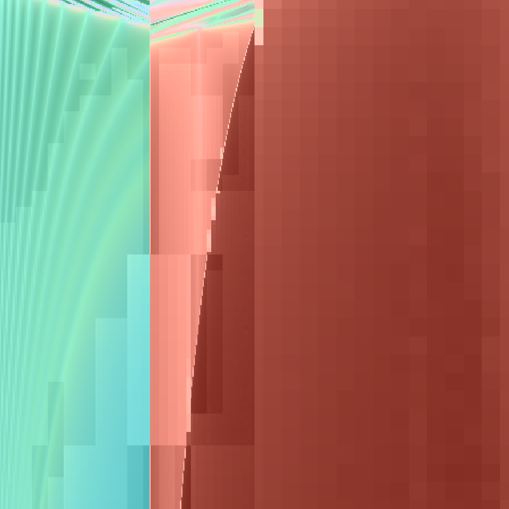
  
  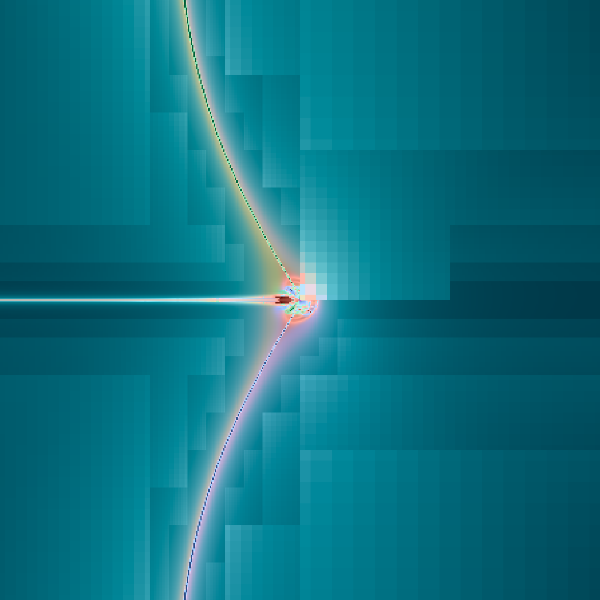
  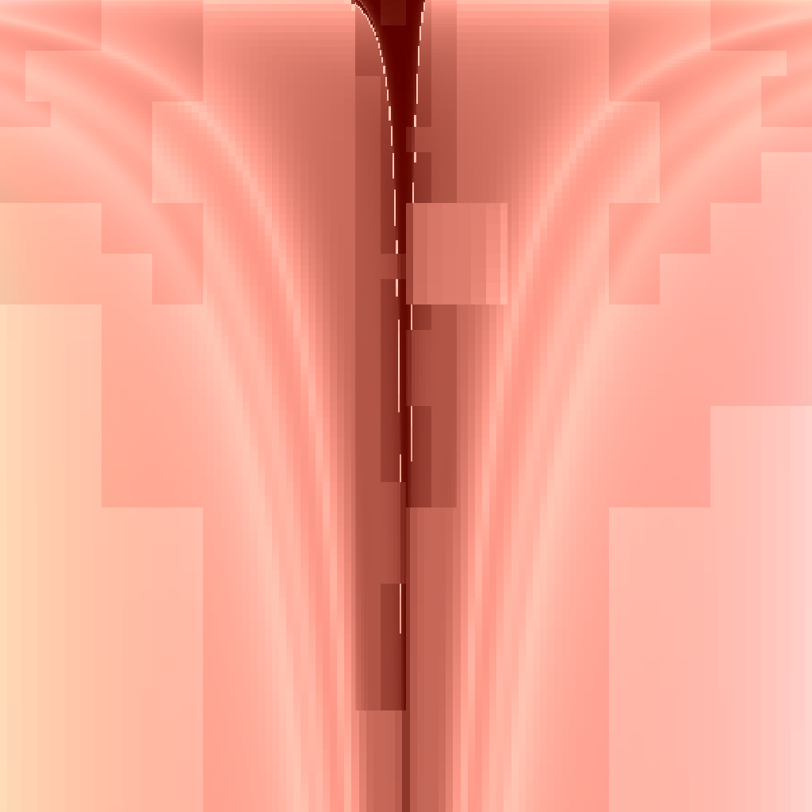
</p>

<p align="center"><i>
eight of the twenty-six charts in the gallery: latent shape, latent mixed, <code>preset_shape_h1</code>,
the classical body plane; the Burrau <code>(ν, K)</code> family, the mass simplex, a
constant-configuration momentum slice, and an <code>(L_z, K)</code> invariant chart
</i></p>

The standing reading was that the chart families are all tame — `alpha` between 0.99 and 1.01, not
exercising the refinement criterion — and that this was a property of where they are centred. It is
not. `preset_shape` and `preset_prho` share `z₀ = 0` **exactly** and differ **5.7× in leaf count**
(577 against 3268), with `alpha` interdecile 3.07 against 0.12.

Only the first sweeps `(alpha, beta)`, the *configuration* coordinates, so it passes through
collision-adjacent shapes. The momentum slices hold one configuration and vary its initial velocity —
every pixel of `preset_prho` and `preset_plambda` is the **same triangle** at a different initial
velocity, so `spread_shape` at `t = 0` is identically zero across the whole slice. That makes the
pair a control that separates configuration effects from momentum effects, and it also breaks a
naive guard: a distinctness check keyed on a body *position* reads 1 of 81 there, which looks exactly
like a collapsed decode and is not — the chart simply does not move that quantity.

**Moving a base point to find chaos is tuning; changing which coordinates the plane spans is not.**

Two further traps that cost real time, both about the *window* rather than the physics:

- `half = 0.05` is a body position in Burrau units on `BodyPlane` and a sigmoid pre-image on
  `Latent`. One shared default shipped every latent preset at a **3× crop** — the structure was right
  and the window was wrong, which reads as *similar but not the same* and sends you looking in the
  physics. `Chart::default_half()` is the one table now.
- A basis that pairs coordinates pairs them **by slot**. Renumbering `alpha` and `beta` into the
  spec's order without carrying their momentum partners gives a genuinely different 2-plane through
  the 8-D space — not a reorientation, which is why it rendered as *twisted* rather than tilted. No
  transposition repairs it, so the test carries the transposition as a negative control: an index
  assertion alone would have passed on it.
</details>

---

## 2. The ensemble, and what the two Halton axes do

A single trajectory through a chaotic region carries no information about whether it can be trusted.
So each pixel carries `E+1` copies rather than one, at offsets inside its own cell:

```
copy k    IC = decode( u + du_k · half_width,  v + dv_k · half_width )
(du, dv)  = a fixed Halton (2,3) prefix indexed by k, scaled to [-1, 1)²
```

The offsets do **two separate jobs**, and conflating them is a mistake this project made in writing
before it made it in code.

**(a) Sub-cell sampling.** The copies are spread across the cell edge to edge — `jitter_frac` is 0.5
and the offsets span `[-1, 1)`, so the ensemble samples the pixel's whole footprint rather than a
neighbourhood of its centre. That is supersampling: the nominal copy is the cell centre, and the
others are where the rest of the cell would have landed had it been rendered finer.

**(b) The spread estimator.** The renderer's actual payload is the *disagreement* between those
copies:

```
spread_shape  =  mean distance of the copies' final shapes from their centroid, halved
spread_event  =  disagreement over the EVENT CLASS -- which pair is currently the tightest
                 binary, evaluated at every sync boundary
```

Smooth dynamics send neighbouring initial conditions to neighbouring outcomes and the spread is
small; chaotic dynamics do not and it is large. **This is the quantity the image displays and the
scheduler refines on.**

Why the offsets are a *fixed* quasi-random prefix rather than a per-pixel random stream:

- **Quasi-random, not pseudo-random.** Halton fills the footprint evenly by construction. Independent
  uniform draws clump and leave gaps, which at `E+1 = 4` or `8` is most of the variance in a spread
  estimate.
- **Fixed, not per-pixel.** Copy `k` sits at the same offset in *every* footprint at *every*
  refinement level, so a parent and its children are compared under common random numbers. Measured:
  the per-quad noise floor falls from 0.4796 to **0.0010** at `E+1 = 8`, and parent/child correlation
  rises from 0.175 to **0.9998**.

It does not buy as much as that suggests. Sampling noise is only ~7% of the scatter in the
refinement exponent (`var` 5.725e-1 → 5.331e-1); the other 93% is chaotic divergence, and **no number
of copies buys that off**. The criterion resolves *regions*, not individual quads, and that is a
property of the physics rather than of the budget.

Two further rules, both of which cost measurements to establish:

- **Never discard a copy.** Every pixel carries exactly `E+1`, always. A badly-integrated trajectory
  is a *measurement outcome* — "this could not be determined" — not missing data. Discarding biases
  the sample toward tame trajectories, which on a chaos instrument is backwards.
- **`error_ratio` is the trust flag**, `max|E_i − median| (t) / same (0)`, aggregated over pixels by
  max. Not a standard deviation, which returns NaN on precisely the pathological pixel the statistic
  exists to flag, and not a median absolute deviation, which is robust in the wrong direction: with
  8 copies one wild value sits above the median of eight deviations and is arithmetically invisible.
  Measured damaged/healthy separation **1.06 with MAD, 59.51 with max deviation**. Treat the result
  as a boolean flag; its magnitude is unstable.

<details>
<summary><b>What else was tried here, and what it cost to find out</b></summary>

**PCG per-pixel streams**, the reference's own scheme, are kept as `Scheme::Pcg` and reproduce every
result measured before the switch. They are never the default again: with a per-pixel stream a parent
and its children draw independent offsets, and the refinement exponent inherits all of that variance.

**Pooling a 2×2 block instead of rendering at two resolutions.** "A fine grid contains every coarser
scale by aggregation" is true of the positions and false of the ensemble: with fixed offsets a pooled
block is four *exact repeats* of one pattern at four cell centres, while a true parent carries offsets
scaled to its own, wider cell. Measured on a control whose true value is exactly 1.0, the pooled
exponent is **+38.6% at `E+1 = 8`** against a true two-resolution error flat at +2.3%. Not a
correction factor — a different measurement.

**Matching sample counts between parent and child.** A parent pools `4(E+1)` copies against a child's
`E+1`, and a spread estimator's expectation depends on sample size, so the exponent is biased +7.6%
at `E+1 = 8` before any physics enters.

**`N` and `E` fail in opposite directions and are not interchangeable.** `N` controls how well a quad
knows its *area*; undersampling inflates the between-footprint variation that drives the exponent, so
coarse `N` **over**-refines — leaf count falls monotonically with `N` (106, 31, 19, 16 at
`N = 4, 7, 8, 16`). `E` controls how well a footprint knows its *value*; undersampling deflates the
within-footprint spread against the tolerance, so low `E` **under**-refines (742 → 2713 → 3463 leaves
at `E+1 = 2, 4, 8`). Never trade one against the other as if they were one knob.

**An `L_z` version of `error_ratio` was proposed and cannot exist.** Released from rest, `L_z = 0` for
every copy, so `σ_Lz(0) = 0` and the ratio is `0/0` — structurally undefined for this entire
configuration family.

**A control with no randomness in it cannot measure sampling noise.** `σ_E(0)` looks like the perfect
control — true exponent exactly 1.0, no integration — and reads 0.003 while not moving with `N` or
`E+1` at all. That is the tell: under a fixed Halton prefix both the offsets and the footprints are
fixed, so the whole quantity is deterministic and the residual is geometry. Keep it as a floor, label
it, and vary a PCG seed for a real draw.

**Read the interdecile, never the variance.** Excess kurtosis on the refinement exponent is **110**:
the variance lives in the tails. The Halton switch cut sampling variance 267,000× on the control and
moved the interdecile *not at all* — quoting the 6.9% variance reduction as the improvement would be
quoting the tail.
</details>

---

## 3. What the colours mean

<p align="center">
  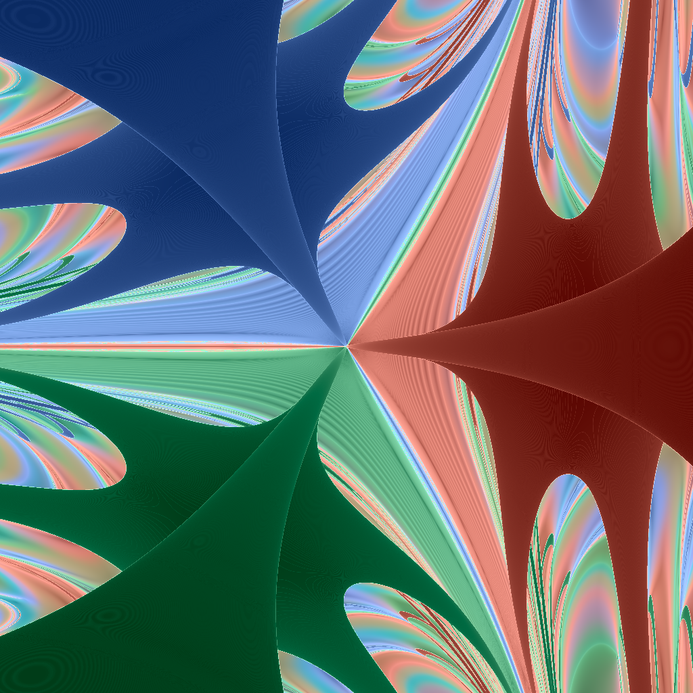
  
</p>

<p align="center"><i>
the same slice under the two colour modes: continuous (hue = final shape, lightness = ensemble
spread) and discrete (hue = terminal outcome class)
</i></p>

### Hue — the shape sphere

Quotient a triangle by translation, rotation and scale and what remains is its **shape**, a point on
a 2-sphere. In mass-weighted Jacobi coordinates `(ρ̃, λ̃)`:

```
a = |ρ̃|²,  b = |λ̃|²,  I = a + b
p = ρ̃ · λ̃,  q = ρ̃ × λ̃

n = ( (a − b)/I,  2p/I,  2q/I )        |n| = 1
```

`I` is the mass-weighted moment of inertia and is deliberately **not floored**, so a triple collision
gives `0/0` — a NaN there is a genuine measurement outcome, not a defect, and the caller records it.

The sphere carries six distinguished points, **computed from the actual masses** rather than
hard-coded, because masses become a chart coordinate on the latent and mass-simplex charts and a
hard-coded site set would be silently wrong on exactly the charts that vary them:

| site | what it is | hue |
|---|---|---|
| collision (0,1), (0,2), (1,2) | the three binary-collision singularities | a maximally separated triad at 30°, 150°, 270° |
| Lagrange ± | the two equilateral central configurations | 90°, 330°, at 45% chroma |
| `λ = 0` | body 2 at the inner pair's barycentre | 210° |

A shape's colour is a **von Mises–Fisher blend** over those sites: weight each by
`exp(κ · n·n_site)`, normalise, and mix their OKLab `(a, b)`. The lightness of a site is discarded —
the production combiner substitutes the scalar's lightness — so hue and lightness carry independent
information by construction.

The sixth site was added on a measurement rather than for symmetry: with five, the worst angular gap
to the nearest site was 1.193 rad and it sat at `n₀ = +1`, the antipode of the (0,1) collision, which
left a whole pole of the sphere blending to one wash. The charts measured use that axis end to end
(`n₀` span 1.9946 of a maximum 2), so the hole was in the part of the sphere the data actually
visits.

An earlier map — `chroma·(cos h, sin h)` with `h = atan2(n₂, n₁)` — was linear (`4.2e-17` agreement
over a sphere sweep) and had no branch cut at all. Its fault was that it was exactly **2-to-1**: it
discarded `n₀`, so a tight binary with a distant third body and a wide pair with a close third
rendered bitwise identically. *Before writing a continuity test, check whether the map is injective.*

### Lightness — the ensemble spread

Lightness is `spread_shape` on a linear ramp between `L_MIN = 0.30` and `L_MAX = 0.92`. Flat colour
means the copies agreed and the dynamics there are predictable; texture means they did not.

The ramp window is each region's own p1–p99, which is a deliberate choice with a named failure mode:
**an auto-ranged ramp cannot tell "no signal" from "signal"**, because a field with no dynamic range
has its noise stretched to full scale. A guard runs before every image and has three arms — the
window's span, the window's floor against the region's own median energy drift, and the spatial
coherence of the ramped scalar, since *amplitude cannot tell a small real signal from noise, and
coherence can*.

The scalar is `spread_shape`, not `ensemble_spread = max(spread_shape, spread_event)`. The event arm
has five distinct values, dominates 1.7% of footprints and all of them in the top tail, so it sets
the p99 and nothing else — a linear ramp over a window 12.7× too wide, set by a staircase describing
1.7% of the region.

### The discrete mode

`Colouring::EventClass` colours by the terminal outcome instead, on a fixed 27-slot alphabet — fixed
rather than data-derived, so the same class is the same colour across two slices. That makes adjacent
ordinals close in colour by construction, so the legend and the per-class histogram are the
instrument and the image is not.

Which mode is right depends on the question. A continuous field and a categorical map cannot look
alike even when both are correct, and comparing across modes is how a rendering choice gets mistaken
for a physics bug. **Every committed image names its mode in a sidecar.**

### One thing the colours never encode

A pixel whose copies failed to integrate is **not** given a reserved colour in any presentation
render. The debug colouring (`Veto::Debug`, magenta) exists and is used in diagnostics; gallery
panels use `Veto::None` and report the count in text and in the sidecar instead. A reserved colour is
a claim about the physics made by the driver's bookkeeping.

<details>
<summary><b>Colour maps and scalars that were tried, and why each was replaced</b></summary>

**The linear two-component map.** `chroma·(cos h, sin h)` with `h = atan2(n₂, n₁)` and
`chroma = C_MAX·hypot(n₁, n₂)` is identically `C_MAX·(n₁, n₂)` — agreement `4.2e-17` over a sphere
sweep — so it is linear and has **no branch cut at all**. It was replaced because it is exactly
**2-to-1**: it discards `n₀`. The diagnosis reached for first was a seam, which is the failure that is
easy to name and was not the one present.

**Five landmark sites instead of six.** See above — the sixth was added because the largest angular
hole sat on an axis the data uses end to end.

**Euler points as sites.** The collinear Euler configurations lie on the same great circle, between
adjacent collision points. Adding them as sites localises nothing, because their colour is the
interpolation the blend already produces; they are kept as overlays and as a test.

**`ensemble_spread` as the ramped scalar.** `max(spread_shape, spread_event)`. The event arm has
**five distinct values**, is modal at 98.2%, and dominates only **1.7%** of footprints — all in the top
tail. So it set the p99 and nothing else: the window ran to `2/7` where the continuous arm's own p99
is 12.7× narrower. Colour on `spread_shape`, and print the quantisation and the event-arm fraction
before any image.

**`Veto::Quiet` for undetermined pixels** — painting them at the ramp floor in their own hue instead
of magenta. It moved the artefact rather than removing it: the pixels became a dark muddy patch in
exactly the same places (`healthy [125,138,140]` against `quiet [36,48,50]`). A quiet reserved colour
is still a reserved colour. Presentation renders now do not consult the flag at all, and report the
count in text.

**A ratio test for the auto-ranged ramp** — "reject a window whose span is too small". It missed the
case it was written for: `far` reads `error(root) = 0.60` under the shipping colouring with a window
of `(1.3e-9, 1.1e-8)` — a span of **×8**, above any sensible ratio bound. The second arm compares the
window's floor against the region's own median energy drift; the third reads spatial coherence, since
in a tame region an absolute floor falls with the field it is meant to bound.

**`ensemble_spread` carries a scale term, and this is stated rather than corrected.** It is a spread
over copies jittered within the *cell*, and the cell halves each level. Measured per level, the median
spread ratio runs 1.19–1.62, falling with depth to 1.048 — sub-linear and saturating, the
chaotic-divergence signature, about 12% of the lightness range across five levels. `t_end` is the
scale-free control and is flat at 0.998–1.009. Normalising by cell width would change what the field
*means*.
</details>

---

## 4. The playhead, and what `t` is

<p align="center"></p>

<p align="center"><i>the same slice marched forward — one full render per sync boundary, no tree</i></p>

Structure that looks like noise at one horizon is often a **phase**. Measured on twenty-four initial
conditions spanning one visible band: best-lag correlation **0.9999–1.0000** and the lag growing
*linearly* with `t` — a frequency beat between two slightly different binary periods, not a
divergence. The bound pair hardens over the run (`T = 3.125 → 2.500`), the shape signal runs at twice
the orbital frequency, and one full cycle of accumulated phase is 79.8 px against the field's measured
80.95 px band spacing.

So `spread_shape` is a phase beat in the regular patches and genuine divergence everywhere else. One
slice holds both regimes, the criterion cannot tell them apart, and two trajectories plus a
correlation can.

### What `t` actually is

`G = 1` and the scale symmetry is quotiented out, so `t` has no duration in seconds until a mass and
a length are pinned. What it measures is the system's own **crossing time**: on the latent charts
total mass is 1 and the hyperradius is 1 by algebraic identity (`I = cos²α + sin²α`, the mass factors
cancelling), so `t = 1` is exactly one crossing time.

Pin a mass and a length and it converts, `τ = √(R³ / G M)`:

| pin it to | `t = 1` | `t = 52` |
|---|---|---|
| 1 M☉ total, R = 1 AU | 58.1 days | **8.3 years** |
| 3 M☉, R = 10 AU | 2.9 years | **151 years** |
| 2 M☉, R = 20 AU (α Cen-ish) | 10.1 years | **523 years** |
| 3 M☉, R = 100 AU (wide triple) | 92 years | **4 780 years** |
| Earth–Moon masses, R = 400 000 km | 4.6 days | **8 months** |
| 3 M☉, R = 1000 AU (cluster core) | 2 900 years | **151 000 years** |

Burrau's problem in the repo's own units (`M = 12`, `R = 2.2361`) has a crossing time of **0.965**, so
the `t = 13` horizon is about 13.5 of them.

One caveat on the cadence: `dτ = η · dt_left / (A₀B₀)`, so changing `t_max` at fixed `n_sync` changes
the step size. Rows at different horizons with `n_sync` held fixed are **different discretisations**,
not one trajectory at different playheads.

<details>
<summary><b>Three escape rules, and the one that survived its own persistence test</b></summary>

**`EscapeRule::Reference`** — relative energy `> 0` and receding, transcribed from the reference. It is
**not absorbing**: during a close encounter a pair's instantaneous two-body energy is transiently
positive. Of the 895 trajectories on one slice that escape under an in-loop test and not at the
reference cadence, **0.000 are still unbound one boundary later** — and 0.000 at +2, +3, +4 and +8.
All 895 are transients, and latching them took the escape fraction from 0.0947 to 0.5494.

**`EscapeRule::Distance`** — an absolute separation gate. Simple, and its literal does not transfer
between charts: on the latent charts `R = 1` by algebraic identity so `r_esc = 12` is 12 absolute,
while on Burrau `near-field` (`R = 2.236`) it is 11.18.

**`EscapeRule::Closure`** (shipped) — the direction to the escaping body stops changing over a window
*and* its relative energy is positive. Of the trajectories it fires on, **1.0000 are still unbound at
+1, +2, +4, +8 boundaries and at `3·t_max`** in every region tested.

Four things measured about it that are worth carrying:

- **The closure window cannot resolve inner-binary phase, anywhere.** `t_close = 2π√(d_min³/M)` runs
  17× to 274× below the window in every region, and a two-end chord cannot tell a full revolution from
  stationarity. So rejecting a tight bound pair rests **entirely** on the energy arm. Transcribed, not
  a defect, and the reason neither arm is redundant.
- **A wider window makes the separation worse** — `k` from 1 to 4 runs one region 6.1 → 4.0. And the
  window is a *time*, so `n_sync` must scale with `t_max` or it is a different criterion wearing the
  same name.
- **A collided run freezes and its closure reads exactly zero** — the most "settled" thing in the
  sample, landing in the *bound* population and destroying the gap it is meant to measure. Split
  collisions out and count the exact zeros; do not let a percentile absorb them.
- **Persistence must be read on the energy arm, not on full candidacy.** Closure is a difference of
  neighbouring samples, so it jitters above tolerance on a perfectly settled escape: one slice reads
  0.4777 still-candidate at the last boundary against **1.0000 still-unbound**. Reading the test off
  candidacy would have scored ordinary jitter as a re-binding.

**Two ordering defects found in the same area.** Collision was ranked above escape *unconditionally*,
on the reasoning that it is sampled continuously and therefore fires first — which confuses *detected*
with *occurred*. Deciding by `min(t)` instead: on the reference path, 990 of 996 trajectories that
fired both arms escaped first and were labelled collision, **42.97% of a whole slice**. And `t_end` is
**quantised** wherever escape terminates, because escape is sampled only at boundaries — which renders
as concentric contour bands. Under outcome-class colouring the arcs vanish while the straight edges
survive and sharpen, so the banding is a colouring artefact and the crisp edges are not.

`stop_on_escape` stays **off**. Closure certifies *what* escaped and is silent about whether the
displayed quantity has settled: it fires at a median `t = 11.8` of 13 with persistence 1.0000, and the
shape still moves by up to 0.6 in the remaining 1.2 time units. `|dn/dt| ~ 1/t³` bounds the *rate*; a
small rate integrated over 1.2 time units is not a small displacement.
</details>

---

## 5. Integrators and regularisation

Three regularised integrators are implemented, plus two unregularised controls. All five are run on
the same slices under the same step control, and the differences are large.

| | |
|---|---|
| **Aarseth–Zare** | two of the three pairs regularised about a **reference body**, re-chosen at every sync boundary. Cross-checked against an independent NumPy implementation at `0.000e+00` over all 32 reference points — the only occupant here with an external check |
| **Heggie** | global: all three pairs regularised simultaneously, **no reference body**, so the state is never re-registered mid-run. **The default since 2026-09-02** |
| **logH** | chartless — a logarithmic-Hamiltonian time transformation and *no* coordinate map. Available under RK4 and under a kick-drift-kick leapfrog |
| **plain RK4 / plain leapfrog** | no regularisation at all. The controls |

### Energy drift, one field, six integrators

<p align="center">
  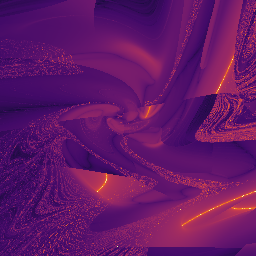
  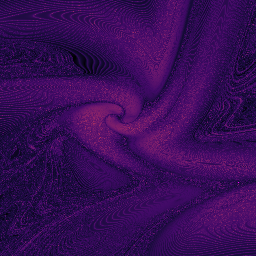
  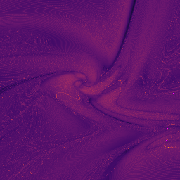
</p>
<p align="center">
  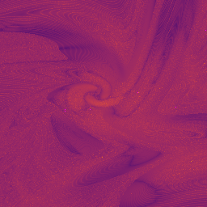
  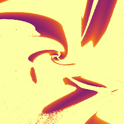
  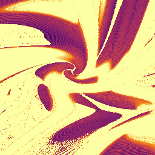
</p>

<p align="center"><i>
<code>|dE/E|</code> per pixel on an inferno ramp, shared colour window across all six.
Top: Aarseth–Zare, Heggie, logH+RK4. Bottom: logH+leapfrog, plain RK4, plain leapfrog.
</i></p>

`config_stability`, 256², `t_max = 50`, unmasked kernel (the repair pass off — it re-integrates from
`t = 0`, has no live analogue, and removes the population the comparison is about):

| arm | drift p50 | drift p99 | `err>10` | evals p50 |
|---|---|---|---|---|
| Aarseth–Zare | 4.210e-8 | 1.434e-3 | 424 | 5.050e5 |
| **Heggie** | **9.033e-10** | **6.477e-7** | **0** | 6.146e5 |
| logH + RK4 | 5.314e-8 | 3.659e-6 | 8 | 6.128e5 |
| logH + leapfrog | 1.461e-5 | 3.468e-4 | 39 | 4.860e5 |
| plain RK4 | 8.351e2 | 7.886e6 | 56 199 | 4.000e5 |
| plain leapfrog | 2.758e2 | 5.650e6 | 47 012 | 4.000e5 |

`err>10` is the count of pixels flagged **not data** out of 65 536.

**The arms are matched on force evaluations, not steps.** RK4 spends four per step and KDK leapfrog
one, so the leapfrog arms run at `η/4`. That is a *nominal* match — the predictive step limit is an
absolute bound rather than an `η` multiple, so it binds less at smaller `η` and the step count lands
below 4×. Read each row at the evaluations it actually spent.

A second caveat, stated because it is easy to violate: each occupant's regularised-Hamiltonian
residual (`ρ/Γ`) is **not one quantity across the table**. AZ's is `|Γ|/largest term`, Heggie's the
same for `Γ*`, logH's is `|K+B−U|/U` — an energy defect normalised by `U`, not an independent
constraint. Compare it down a column, never across one.

### Why Heggie is the default — and it is not the scoreboard

<p align="center">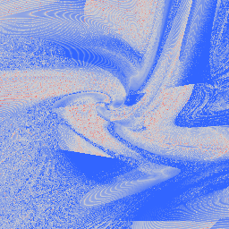</p>

<p align="center"><i>
<code>log10(drift_AZ / drift_HG)</code> on a fixed symmetric diverging ramp — blue where Heggie is
lower. The structure is spatial, which is what no summary statistic could show.
</i></p>

The scoreboard is large: Heggie wins **31 of 32 gallery cases**, and `err>10` across the gallery runs
**3915 against 74**. But a whole-frame median shows only **1.14×**, because two real and opposite
effects are spatially separated. Conditioned on AZ's own drift decile:

| AZ's decile | gain `log10(AZ/HG)` p50 | fraction of pixels better |
|---|---|---|
| d0 (`2.9e-11`–`2.9e-9`) | −1.21 | 0.232 |
| d4 (`2.5e-8`–`4.8e-8`) | −0.06 | 0.487 |
| d7 (`3.2e-7`–`1.3e-6`) | +1.48 | 0.917 |
| d8 (`1.3e-6`–`9.5e-6`) | +1.59 | 0.996 |
| d9 (`9.5e-6`–`9.3e-4`) | **+3.28** | **1.000** |

Heggie fixes AZ's worst decile on **100% of its pixels by a median 1900×**, and loses ~16× on the
tame decile where drift is already `1e-10`. A median over both is the one statistic guaranteed to
show nothing.

**The default rests on a mechanism, not the win count**, because a default justified by a scoreboard
does not survive the next investigation. AZ re-registers its coordinate system whenever the reference
body changes, and neighbouring pixels that re-register at different boundaries diverge — that is a
spatial discontinuity in the *chart*, not in the physics. Measured with step control held constant:
`AZ chord 5.162e-1` against `HG 4.832e-2`, **10.7×**, with three guards — step count flat to 1.3% (so
`η` held the step size), a deliberately confounded arm reading 10× (so the harness *can* see a large
chord in Heggie), and a `refresh_h` arm at 13× (so it sees *boundary* sensitivity specifically).
Without that last arm the null could have been the instrument.

AZ is kept and is not merely legacy: it is the only occupant with an independent implementation, and
it genuinely wins on sustained hierarchy — on `far`, all 65 536 pixels, by a flat 0.7–0.9 decades.

<details>
<summary><b>logH loses decisively, and that establishes nothing</b></summary>

logH was built as the falsification test: if Heggie's advantage is *no re-registration*, then a method
with no reference body should inherit it. It loses by 29× to 1494× under RK4 and 16,000× to 215,000×
under leapfrog, at matched force evaluations, and comes third against an IAS15 reference.

That settles nothing, because logH differs from Heggie in **two** ways — no re-registration *and* no
coordinate transformation — and the second is fatal on these slices. logH reaches `d_min < 1e-10` and
**never** `|dE/E| < 1e-12`, its drift *rising* with penetration depth where Heggie's regularised drift
is flat at `4.4e-15`. A KS map removes the `1/r` from the Hamiltonian; a time transformation only
slows the clock. Every region tested is collision-dominated, so logH was graded almost entirely on the
one thing it is known not to do.

**A chartless method is not a coordinate regularisation with the coordinates left out.**
</details>

<details>
<summary><b>Cost, measured per call and per trajectory, because they are different numbers</b></summary>

Heggie's paper quotes ~1.6× the computing time per step for `Γ*`'s extra terms. Measured here per
`deriv` call, single-threaded: AZ **20.29 ns**, Heggie's Eq. (20)/(21) form **17.82 ns** (0.88×), the
Eqs. (22)–(24) form **27.40 ns** (1.36×). The planar reduction is why — Heggie's 4-vectors collapse to
2-vectors and his 4×3 blocks to 2×2.

But AZ's `deriv` calls `r3.powf(3.0)` rather than `r3*r3*r3` **deliberately**, to route through the
same libm call NumPy does so the cross-check stays bitwise. Timed in isolation that is 6.42 ns against
0.43 ns, so up to 28% of AZ's per-call cost is ulp fidelity rather than algebra, and against AZ's
algebra alone the ratios are ~1.22× and ~1.88×.

The step *count* does not follow the per-call cost, because step size is set by the time
transformation: `dt = R₁R₂R₃ dτ` is not `dt = A·B·dτ`. Burrau to `t = 6`: **677,714 steps against AZ's
683,748**, a ratio of 0.99. Quote the two factors separately; neither alone is the cost.
</details>

---

## 6. Step control

The most visible artefacts in this project turned out to live here rather than in the integrator.

A single RK4 step was advancing the physical clock by **2.209e128** against a sync interval of 0.4.
`1e128` is finite, so the `is_finite` guard passed; it satisfied the landing test by 128 orders, so
the march recorded a *clean landing*; and the clock was then corrected to the boundary while the state
kept what it reached. An unbounded step with no acceptance test, invisible in every recorded quantity
until a diagnostic was built for it.

The cure is one divide, from values the derivative call already returns:

```
dτ  ≤  f · d_min / ( |v_rel|_max · A · B )        f = 0.02
```

That is a **pericentre-resolution** condition. Rauch & Holman (1999) show the Wisdom–Holman mapping
goes artificially chaotic through overlap of step-size resonances unless the step resolves periapse,
and quote `T_p/20`; this ships at 1/50. Measured: `error_ratio` p99 **7.108e9 → 1.109**, overshoot
count **634 → 0**, for **+1.9% of the steps**.

Two supporting mechanisms:

- **`DtauMode::PerStepInterval`** recomputes `A·B` per step with the remaining interval held fixed,
  capped at the interval's entry value. Sizing `dτ` once per interval blows up after an encounter that
  *coincides with a boundary*, because `dt = A·B·dτ` and `A·B` grows by orders as the bodies separate.
- **`clamp_final_step`** lands the last step of an interval on the boundary instead of overshooting
  it. This is a correctness property, not a tidiness one: figure-eight closure across
  `η ∈ [0.02, 0.001]` gives convergence order **1.06 unclamped and 2.08 clamped** under AZ, 1.03 and
  2.40 under Heggie.

The Chenciner–Montgomery figure-eight is the instrument for that last measurement, and it is worth
naming: it is exactly periodic, so `|state(T) − state(0)|` is a pure error with no reference
trajectory and no chaos, in under a second.

<details>
<summary><b>Four step-limit candidates: one won, one is not viable on a GPU, one was already shipped under another name, and the dumb control failed at four times the cost</b></summary>

**A — reject and retry.** Take the step, test the increment against its own remaining interval, halve
and retry on failure. Reaches the same quality as B at **+77% of the steps** on CPU, and is not viable
on a GPU. The number that says so is not the divergence factor — `mean(max per warp)/mean(per lane)`
rises 1.577 → 2.557, but the *absolute level* is the field's, not the mode's, since step counts vary
lane to lane with no retries at all. The killer is that at the parameter A needs, **every warp contains
a retrying lane (1.0000, both dispatch shapes)** and the worst lane retried 5.2 million times. A also
**plateaus above 1.0**: at 4× the cost the error goes *up*, because a halving ladder bounded at 8
cannot reach where one well-chosen step goes directly.

**B — the predictive limit** (shipped). One divide, branch-free, no trial step and no retry.
`error_ratio` p99 **7.108e9 → 1.109**, flagged fraction **0.1110 → 0.0000**, overshoots **634 → 0**, at
+1.9% of the steps.

**C — an `A·B` growth clamp.** Bitwise identical to the baseline at every parameter, because it was
already shipped: the brief's form assumes `dτ` fixed across the interval, and under the shipped
per-step mode `dτ = η·dt_left/(A·B)` is recomputed each step, so `dt ~ η·dt_left` however much `A·B`
grows. Kept as a two-armed test — inert under one `dtau` mode, active under the other — so if the older
mechanism ever changes, the thing that silently starts mattering announces itself.

**The dumb control — a uniform `η` cut.** `f = 0.25` globally leaves **153 overshoots** and 7.67% of
pixels flagged, at **four times** the baseline step count. A uniform refinement buys accuracy
everywhere and still cannot bound a step whose size is set by *local* geometry. That is the argument
for a per-step limit over a global one, and it comes from the control rather than from the candidate.

**And a named non-candidate.** Putting the remaining time in the numerator —
`dτ = η(dt_left − s.t)/(A·B)` — gives `rem_{n+1} = rem_n(1 − η)`: the interval is approached
geometrically and never completed. Its drift is **the best in the table by ten orders**, because it
went nowhere. Kept as `DtauMode::PerStepRemaining`, a named axis and never a candidate, and it is why
`t/t_max` is printed before any drift column.

**Three tests failed when the limit shipped, and every one failed correctly** — one on its own guard
(*nothing was flagged, so this test has no subject*), one because its damaged population no longer
existed, and one because the residual it tracks became round-off rather than truncation. All three are
pinned to `StepLimit::None`, the kernel they characterise. That the fix deletes the subject of three
characterisation tests is the strongest corroboration in the suite.
</details>

---

## 7. The refinement scheduler

<p align="center">
  
  
</p>

<p align="center"><i>the adaptive render, and the tree that produced it — always draw both</i></p>

Rendering every pixel at full depth is not the goal; spending a budget well is. A quadtree descends
the slice, each quad sampling `N × N` footprints of `E+1` copies, and decides for itself whether
splitting buys anything.

The wireframe is not decoration. A coarse texel tells you a leaf is coarse; only the wire tells you
whether the tree subdivided *around* a structure or straight *through* it. A bad tree survived an
entire build unnoticed because the boundaries were drawn over a uniform base rather than over the
adaptive render.

### The split rule

**Split iff any footprint in the quad is unresolved.** There is no exponent in the split test:

```
unresolved(f)  ⟺  spread_shape(f) > eps            the payload has not settled
               ∨  the copies disagree on event class
               ∨  the footprint is undetermined     (non-finite spread, or an unusable copy)
```

`eps` is a tolerance in `spread_shape`'s own units — the same units in every region, unlike the
previous policy's threshold, which had to sit inside a distribution whose median moves six orders
between regions.

### The stop rule

A fractal region is unresolved at every level and would descend forever, so the stop is an exponent on
the quantity the policy actually optimises — the **area** that remains unresolved:

```
alpha_area = log2( unresolved_area(coarse) / unresolved_area(children) )
```

A line reads **1**, a sea reads **0**, and a boundary of box dimension `d` reads **2 − d**, so
`alpha_lo` is a *dimension* threshold. The shipped default is `alpha_lo = 0.005`: a split is floored
only where its children resolved essentially nothing, judged as no-gain at a noise margin rather than
as a dimension cut. At `0.2` the same floor costs 11% of `config_stability`'s resolvable pixels and
puts its tree *above* uniform at its own error; at `0.005` no chart is above uniform.

Two details, each of which cost a measurement:

- **The exponent is judged over two levels, not one.** A footprint cell on a quad boundary is shared
  by both quads at half weight, while the finer grid below locates the same structure on one side at
  full weight — so a shore in an edge cell read *no gain* on the side it was on and *infinite* gain on
  the other, and its children floored. Judged from the grandparent's quadrant, whose cells split
  cleanly at the midlines, min 1.00 and max 1.05 over 15 splits against 0 under the one-level form.
- **Noise is told from structure by neighbour agreement**, per footprint, not by a coherence statistic
  with a base rate in it. An unresolved footprint counts as structure iff at least two of its eight
  neighbours share its class *and* land within ~11° on the shape sphere. A sea's neighbours are
  independent draws, so two agreeing by chance is a few in ten thousand. This arm is calibrated on
  white noise and is nearly inert on the real charts, where seas are coherent sponges rather than
  white — it floors 2–37 quads where the dimension floor floors 262–334.

### Merging — the split rule read backwards

Under a live playhead the field changes as `t` advances, so the tree must be able to *coarsen*:

> A parent whose four children are all leaves that did not split this boundary is **merged back**
> when the parent has become resolved (`Keep`) or its split shows no gain (`Floor`).

The children become `Decision::Merged` rather than leaves, and `QuadTree::resident` — what a live
design actually holds — is tracked separately from `quads_computed`. On a moving pulse fixture,
resident runs 37 → 85 → 37 → 69 while 181 quads are computed, and the final tree is bitwise the static
tree at the horizon.

A merged parent remembers its own exponents, so it is not re-split into the same four children every
boundary; that memory expires when the quad's structured weight leaves a factor of two of where the
split was judged. Two subtleties:

- **Expiring a memory by deleting it is the opposite of expiring it.** `decide` reads *no memory* as
  *never merged for no gain*, so clearing the record reverts to first-time behaviour and floors more,
  not less — measured 421 quads against 645. A separate expiry flag is needed, and an `assert_ne!`
  cannot tell the two apart.
- **A capped leaf must stay re-decidable.** A leaf stopped by the camera floor originally left the
  frontier permanently, so a parent that later resolved could never merge it — 149 quads against a
  static 69, finer rather than coarser. Caps are re-tested every boundary, because a resolved quad is
  decided *ahead* of the caps.

### What is displayed

Every node with samples is drawn, coarsest first, with leaves last — not leaves alone. Drawing only
leaves left an uncomputed region as raw background, which reads as *nothing here* rather than *not yet
resolved*. Where the tree is complete this is bitwise identical, because leaves tile the root exactly
at any depth difference (measured: zero gaps, zero overlaps).

<details>
<summary><b>Four things stop a descent, and usually it is not the criterion</b></summary>

| stop | what it means |
|---|---|
| `ScreenFloor` | the quad's texels are below display resolution — a **veto, never a trigger**, and never cached on a quad, so a floored quad refines again when zoomed into |
| `MaxLevel` / `MaxRelDepth` | a depth cap |
| `BudgetExhausted` | the budget ran out. A quad merely outranked by the frontier is `Deferred`, never this |
| the criterion | `Keep`, `Floor`, `Undetermined`, `Collapsed` |

Measured across the corpus, the camera veto stops **≥95% of leaves on 21 of 69 dumps** and the budget
up to 91%. For most of this project's history every leaf count was quoted as a criterion decision, and
the observed uniformity was a permissive criterion under a terminating veto rather than the criterion
saying *split*. **Never quote a leaf count without its stop-reason breakdown.**
</details>

<details>
<summary><b>Ranking under a budget, and what "beats random" is worth</b></summary>

Under a budget the frontier is ranked by a priority and truncated to the top `k_frac`. Three reference
points, and the names matter: **floor** = a five-seed random band, **reference** =
`greedy_lookahead_1`, **ceiling** = `dp_optimal`, the exact minimum over all tree-shaped leaf sets —
which is cheap, 5461 splits in 0.01–0.03 s, because the 4-way merge is three 2-way convolutions and
each node's cap is bounded by its own subtree.

Greedy is **not** a bound, and the old name `greedy_oracle` cost two PRs: on `far` it reads 0.54760
against a random band of 0.48550–0.52047 — the worst strategy in the table, under a name asserting it
could not be. A criterion beating greedy indicates lookahead value, not a bug.

Neither is random the bar. Against **breadth-first**, which was missing from every table in the corpus,
most standing comparisons change sign. And on a smooth field, ranking by spread *is* breadth-first — a
quad of width `w` over a gradient `g` has variation `~g·w`, so argmax-on-spread picks the shallowest
quad — which is within `2e-5` of exactly optimal there. **A featureless region degenerating to uniform
is correct behaviour**, and `far` is the control that shows what that looks like.
</details>

<details>
<summary><b>The criterion before this one, and why no error curve noticed it was inverted</b></summary>

The original policy split where `alpha = log2(spread_parent / spread_child)` was **large** — that is,
where halving the cell had *already* halved the spread. Those are the smooth, converging regions. It
floored or kept exactly the discontinuities and the fractal mixing it existed to find. On one chart it
refined a smooth regular island and floored the fractal core at level 2.

It survived because every `error(B)` curve that graded it scored OKLab distance under the *shipping
colouring*, whose lightness is auto-ranged to each region's own p1–p99. A smooth region's `1e-8`
residual counted as error at every depth, so breadth-first came out near-optimal **by construction of
the metric**.

Scored on the payload instead — nominal shape and event class against a fixed tolerance in the
spread's own units — the same footprints give `far` resolved at the root, `near-field` zero unresolved
at **137 quads against uniform's 5449**, and `deep interior` 329 against 5377. The tolerance policy
reaches zero on both within 1.12× of the exact optimum; the alpha policy stops at the bootstrap.

`Policy::Alpha` is kept as the named legacy and pinned bitwise, because every number in the older
corpus was measured under it.

**A related correction about what the regions are.** `deep interior` was described as "structure
everywhere" on the strength of that metric reading 0.379 at its root. Its actual sea fraction at
`eps = 0.01` is **0.0025** — a quarter of a percent of its pixels are unresolvable at the deepest
level. The chart that *is* a sea is `preset_shape_h1`, at 34%.
</details>

<details>
<summary><b>Criteria that were compared, and the two findings that survived the corpus going stale</b></summary>

Before the tolerance policy, a long comparison ran over candidate *rankings* — what to prioritise
under a budget. The numbers are field-conditional and were taken on the superseded kernel, but two
results are about the shape of the problem rather than its values.

**Signal resolution is not what makes a ranking good.** `within/median` orders quads on **5418 distinct
values of 5461** and is beaten by random at every budget past 383. `frac_hot_between/median` — simply
counting how many footprints in a quad are above a threshold — was the best criterion measured on the
project, on **31 distinct values with an 83.1% modal share**. And a criterion that is `NaN` on 97.1% of
a region still reached the optimum by `B = 383`: the 2.9% it scores are the right quads. A high NaN
fraction is a property to read, not a defect to hide.

**Two different faults give the same flat error curve: a bad ordering and no ordering.** Count the
signal's distinct values before reading any curve — a fine-grained ordering that is actively wrong and
a constant that provides no ordering at all produce the same picture, and `error(B)` alone cannot tell
them apart. The second case's curve is just the tie-break's scan order.

Things tried in that comparison and rejected:

- **A structure term** — connectedness × thinness × extent, multiplied into the signal. §2.2 of the
  brief recommended multiplying. Measured, multiply **never helps** and takes the best criterion from
  0.07038 to 0.13133 on the one chart the criterion actually controls — from greedy's neighbourhood to
  worse than the random band's upper edge. `replace` is worse and is **not a second data point**: the
  code discards both arguments, so three table rows were one expression printed three times.
  The three factors are individually correct — a single isolated hot cell scores 1.0 on connectedness
  × thinness alone, which is why extent exists — and the composite still loses.
- **A quantile hot rule** instead of an absolute threshold. It desaturates the mask exactly as
  intended, and every criterion built on it still loses to a saturated 31-valued count. Under a
  quantile rule the count above the cut is set by the rule rather than the field (31 of 64 at
  `q = 0.5`), so `frac_hot` carries essentially nothing. **Both masks are kept**, because replacing
  the absolute one would have deleted the best-performing signal and read as an improvement.
- **The obvious desaturation test cannot fail.** "Assert `n_hot < N²` for a stated majority" passes
  trivially under any quantile rule. The form with teeth runs both masks over one descent and asserts
  they *disagree*.

And the mask saturation is **regional**, which is what made it hard to see: in one region the mask is
full (98.8% of leaves), in another it is **empty** — `far`'s median is `4.26e-8` against a threshold of
`1e-4`, so nothing clears the cut, `n_hot == 0`, the perimeter ratio is `NaN`, and every mask-derived
criterion takes one distinct value over all 16 leaves. A full mask and an empty mask are the same
threshold landing on either side of a distribution.
</details>

<details>
<summary><b>Why a fixed threshold was abandoned, and why the treadmill argument for it was backwards</b></summary>

`tau_display = 1e-4` sits at the **0.4th percentile** of one directory's leaf-spread distribution and
the **4.3rd** of the whole corpus — so 95.7–99.6% of quads clear it and the tree is uniform at max
depth. The other side is in the same corpus: where the bulk sits *below* the threshold everything is
kept and the tree is uniform at depth 2, **16 leaves against a complete 4096**. Sixteen of the
eighteen trees the camera veto does not bind are stopped one of those two ways.

Selectivity requires the threshold to cut *through* the bulk, and the regional spread medians span six
orders (`4.26e-8`, `9.45e-5`, `9.75e-4`). **A ranking cannot land above or below a distribution**; a
threshold can, and does.

The standing argument *for* a fixed threshold was that spread grows with `t` everywhere, so any fixed
value must eventually fire on every quad — a treadmill. Measured on a fixed tree across
`t ∈ {4..20}`, **the opposite happens**: one region's median leaf spread peaks at `t = 10` and then
falls **81×**, ending below the threshold; another falls 31× monotonically. The mechanism is already on
record one level down — **terminal states are absorbing**, so as termination saturates the copies share
an outcome and the disagreement collapses. At large `t` a fixed threshold fires *nowhere*, the tree
**shrinks**, and a rise-then-collapse has no correct fixed value at either end.
</details>

<details>
<summary><b>Knobs measured and not adopted</b></summary>

- **Stationarity stops** — quadrant mixture and class-conditional coherence, to catch a quad that is
  statistically the same at two scales. Worse on every chart where it fires: on one, full-depth error
  0.3% → 6.4%; on another, 0.01% → 1.2%. And where it fires it is wrong, because the mixing regions are
  **coherent sponges at the footprint scale**, not white noise, and coherence correctly reads them as
  structure. A stop calibrated on white noise is a stop for white noise. Default **off**, arms still
  computed and dumped.
- **A time-to-live on the no-gain merge memory.** Every rung displays worse while computing less —
  error 0.19609 shipped against 0.20300 and 0.21920 — the same budget-quality trade as `k_frac`. And
  `ttl = 1` and `ttl = 4` are **bitwise identical**, because a lapsed memory splits, the split still
  shows no gain, the merge pass re-merges and records a *fresh* memory: beyond one boundary the clock
  is inert. `ttl = 1` is marginally *better* against uniform and absolutely worse, so a ratio-only
  table would have read as a win.
- **Foveation** — modulating camera relevance by cursor proximity. Inert on a chart where structure is
  localised, because only quads straddling the discontinuity want to split and the quota never has to
  choose. Where structure is everywhere, `×16` saves 8 frames at the cursor and **loses 2 at the
  edge** — the same budget moved. The final tree is bitwise identical in every arm; foveation changes
  *when* a region resolves, never *what* the tree becomes. Default **off**.
- **2:1 balance.** Every forced split integrates `N²(E+1) = 512` trajectories, at 1.03–1.76× the tree.
  It is a *rendering* requirement paid for in physics, and this renderer cannot show the benefit:
  texels are nearest-neighbour clipped to the quad box and quadtree leaves tile the root exactly at any
  depth difference, so an unbalanced tree produces a resolution *step*, not a hole. It becomes
  load-bearing under interpolation across leaves or when quads are drawn as GPU geometry. Kept as a
  flag.
- **`balance_forced / splits` is not a quantity.** The same tree reports 0.113 or 0.007 depending only
  on the throttle, a factor of fifteen, and the ordering across charts does not survive either
  (`spearman = +0.771`, the same statistic on the same six trees disagreeing with itself).
- **`k_frac`, the frontier throttle**, is a budget-quality trade rather than an improvement at fixed
  cost. Depth variance peaks at 0.25 and the tree loses a whole level at 0.05, but the *displayed*
  error rises monotonically as `k` falls — the tree simply displays less. The selectivity is in the
  shape.
</details>

---

## 8. Where the implementation went past the brief

Several mechanisms here are not what was specified. In each case the spec's version was implemented
first, measured, and found to have a failure mode; what shipped is the replacement, and the
measurement that forced it is the reason to trust it.

### Triple collision and triple ejection — the ≥2-pair rule

The outcome encoding originally had two terminal classes, binary collision and escape. A triple is a
distinct physical event and needed its own label, and the obvious rule — *all three pairs below
`r_coll`* — is wrong.

By the triangle inequality, `|AB| < r_coll` and `|AC| < r_coll` forces `|BC| < 2·r_coll`. So "exactly
two pairs" is a reachable state and is **already a near-triple**; requiring all three would silently
classify it as an ordinary binary collision. The shipped rule is **two or more pairs**, encoded as
`detail = 3` for both arms — triple collision and triple ejection.

A related correction sits underneath it. The brief warned that one region (`deep interior`) is a
triple-collision zone and intractable. It is not: measured in both implementations, pair (0,2) closes
to `2.28e-5` while pairs (0,1) and (1,2) never register even at `r_coll = R`, and it reaches `t = 13`
in about a second at `|dE/E| ~ 1.4e-7`. The 190-second failure that produced the warning was the
*unregularised* integrator. **A "this region is intractable" assumption has already produced one
false finding on this project.**

### The escape criterion

<details>
<summary><b>The specified rule is not absorbing, and the replacement passes the test that killed it</b></summary>

The reference's rule — relative energy `> 0` and receding — was implemented and behaves badly, for a
reason that is obvious once measured and invisible before: during a close encounter a pair's
instantaneous two-body energy is *transiently* positive. Of the 895 trajectories on one slice that
escape under an in-loop test and not at the reference's cadence, **zero are still unbound one
boundary later** — and zero at +2, +3, +4 and +8. All 895 are transients, and latching them moved the
escape fraction from 0.0947 to 0.5494, over half the slice.

The shipped rule adds a **closure** arm: the direction to the escaping body stops changing over a
window *and* the relative energy is positive. Of the trajectories it fires on, **1.0000 are still
unbound at +1, +2, +4, +8 boundaries and at `3·t_max`**, in every region tested.

Three further things were fixed in the same area, each of which had been silently wrong:

- **`min(t)` decides precedence.** Collision was ranked above escape unconditionally, on the reasoning
  that it is sampled continuously and therefore fires first — which confuses *detected* with
  *occurred*. On the reference path, **990 of 996** trajectories that fired both arms escaped first
  and were labelled collision: 42.97% of a slice.
- **A bounded confirmation lag.** `escape_confirm` holds an in-loop detection provisional until the
  next boundary and commits the *first crossing* time. That makes the sampling stride a **cost** knob
  rather than a correctness one.
- **The escaping-body label is index order, not physics.** The reference's `argmax` over a boolean
  fire vector returns the lowest firing index, and on a dispersing system all three bodies read
  unbound. Transcribed as-is rather than corrected, with 14 of the 40 golden rows discriminating it —
  a "fix" here would silently diverge from the reference.
</details>

### The trust statistic

<details>
<summary><b>Two estimators were tried before the one that separates damaged pixels</b></summary>

`error_ratio` asks whether a pixel's ensemble can be trusted: the spread of the copies' energies now,
over the same at `t = 0`. Under exact dynamics it converges to exactly 1.

The first form used a **standard deviation**, which returns `NaN` on precisely the pathological pixel
the statistic exists to flag. The second used a **median absolute deviation**, robust — and robustness
is the wrong property here. With 8 copies, one wild value sits above the median of eight deviations
and is arithmetically invisible. Measured damaged/healthy separation: **1.06 with MAD, 59.51 with max
deviation**. A pixel whose worst copy drifted 120× the total energy read 1.1369 under MAD, inside the
healthy p99 of 1.0756.

The shipped form is `max|E_i − median|`, with non-finite treated as an infinite deviation, aggregated
over pixels by **max** rather than median — a separate decision at a different level, and one that
tracks damage at Spearman +0.956 against +0.599.

The MAD form is still computed and dumped. It is never gated on, and the test that pins the decision
asserts the two against `refine_threshold` — the shipped value that actually decides re-integration —
rather than against a constant fitted to one integrator.
</details>

### The ensemble offsets

<details>
<summary><b>The spec asked for per-pixel seeding; the shipped scheme is stronger and simpler</b></summary>

The brief required per-pixel seeding from `(i, j, seed)` so that any pixel is reproducible in
isolation. The shipped scheme is a **fixed** Halton (2,3) prefix indexed by copy index, which is
reproducible in isolation for a better reason: it does not depend on the pixel at all.

That buys the property the spec was reaching for and one it was not — a parent and its children share
the perturbation pattern, so they are compared under common random numbers by construction, and the
sampling noise largely cancels in the ratio the refinement exponent is computed from. The per-quad
noise floor falls from 0.4796 to **0.0010**; parent/child correlation rises from 0.175 to **0.9998**.

Per-pixel seeding survives as `Scheme::Pcg` and reproduces every result measured before the switch.
</details>

### The disagreement field

<details>
<summary><b>Over the event class, not the terminal outcome — a statistic that was confident when it knew least</b></summary>

`spread_event` was originally the disagreement over the **terminal outcome**. That is terminal-grain,
and it inverts under lockstep: early in a march nothing has terminated, every copy agrees, and the
field reports maximum confidence at exactly the playhead where least is known.

The shipped contributor is the **event class** — which pair is *currently* the tightest binary,
evaluated at every sync boundary, joined with the terminal state for copies that have finished.
Measured on 1024 near-field pixels at `t_max = 8`: **110 nonzero against 0**; at `t_max = 13`, 165
against 22 and strictly nested. The gain is coverage and horizon-independence, not lead time — on
pixels both flag, the lead is zero.

The `(state, detail)` encoding stays as the **outcome**, for classification and rendering. Two fields,
two jobs.
</details>

### The refinement criterion, and the exact ceiling to score it against

<details>
<summary><b>A tolerance rather than an exponent, an area exponent rather than a spread one, and a bound that is actually a bound</b></summary>

The brief specified a refinement exponent — split where `alpha = log2(spread_parent/spread_child)`
crosses a threshold. Section 7 covers why that is inverted; what replaced it is a **tolerance** on the
displayed payload for the split test, with the exponent demoted to a *stop* and rewritten to measure
the quantity the policy actually optimises:

```
alpha_area = log2( unresolved_area(coarse) / unresolved_area(children) )
```

This is the no-gain test the exponent policy was trying to be. It reads 1 on a line, 0 on a sea, and
`2 − d` on a boundary of box dimension `d`, so its threshold is a *dimension* threshold rather than a
tuned constant.

Alongside it, the scoring changed. The brief's reference point was a greedy strategy, named
`greedy_oracle`. **Greedy is not a bound** — on one region it reads 0.54760 against a random band of
0.48550–0.52047, the worst strategy in the table, under a name asserting it could not be — because on
a tree the gains are neither independent nor immediately available: a quad whose own split gains
little may unlock large gains two levels down.

The real ceiling is `dp_optimal`, the exact minimum over all tree-shaped leaf sets, and it turned out
to be **cheap**: 5461 splits in 0.01–0.03 s, because the 4-way merge is three 2-way convolutions and
each node's budget cap is bounded by its own subtree. The naive `O(quads × B²)` reading is wrong
twice. Three roles are now named wherever a curve is quoted — **floor** = random band, **reference** =
`greedy_lookahead_1`, **ceiling** = `dp_optimal` — and the bound is asserted at scale rather than
assumed: worst margins `+0.0e0`, `-1.4e-16`, `-1.4e-17` across three regions.

Two smaller additions in the same area:

- **`Decision::Undetermined` is a second variant, not a widening of `Collapsed`.** A collapsed decode
  is repeated initial conditions and refining makes it worse; an undetermined quad has distinct
  initial conditions and finer `η` is its remedy. Different causes, different remedies, and a
  stop-reason breakdown that pools them is the thing the breakdown exists to prevent.
- **The camera floor is a veto that cannot be a trigger, by type.** `Camera::veto` returns
  `Option<Decision>` and has no way to return `Split`. It is also view-relative and never cached on a
  quad, so a floored quad refines again when zoomed into.
</details>

### A second regularisation, and the instrument that grades them

<details>
<summary><b>Heggie was not in the brief, and neither was the figure-eight</b></summary>

The brief specified Aarseth–Zare and one integrator. Heggie's global regularisation was added as a
*hypothesis test* — if AZ's spatial discontinuities come from re-registering the coordinate system at
a reference-body switch, then a scheme with no reference body should not have them — and it won on
the measurement, then became the default. logH was then added as the falsification test for that
mechanism, and section 5 covers why its loss establishes nothing.

Grading them needed an instrument the brief did not have. Energy drift is **blind to a whole class of
defect**: the landing clamp buys 24,000× on a periodic fixture while moving one region's median drift
37× the *wrong* way, because the overshoot displaces the state in **time** and the regularised energy
is nearly stationary along the flow.

The Chenciner–Montgomery figure-eight is the instrument. It is exactly periodic, so
`|state(T) − state(0)|` is a **pure error** — no reference trajectory, no chaos, under a second per
run. Convergence order across `η ∈ [0.02, 0.001]`: **1.06 unclamped, 2.08 clamped** under AZ; 1.03 and
2.40 under Heggie. The unclamped arm is the control, and it is what makes the clamped number mean
anything.

One more measurement worth keeping, because it corrected a *cited* claim rather than a bug: Heggie's
paper contrasts his scheme's label-independence with AZ's. Measured over all five non-identity label
permutations, Heggie reads `1.76e-14` and **AZ reads `3.23e-15`** — AZ is better, because relabelling
is physically empty and AZ's reference body is chosen from geometry. But freezing that choice and
re-running gives `3.411e-6`, a factor of **1.06e9**. So the contrast is real and is drawn against a
*fixed-reference* AZ; this port does not exhibit it because it already pays the price that buys it
off — **and the wedges were that price**.
</details>

---

## 9. Defects found, and how they were found

Most of what is written above was arrived at by being wrong first. The interesting part is rarely the
bug — it is that the diagnostic in place at the time said the code was fine.

<details>
<summary><b>The wedges — a step-size failure that looked like a regularisation failure</b></summary>

<p align="center">
  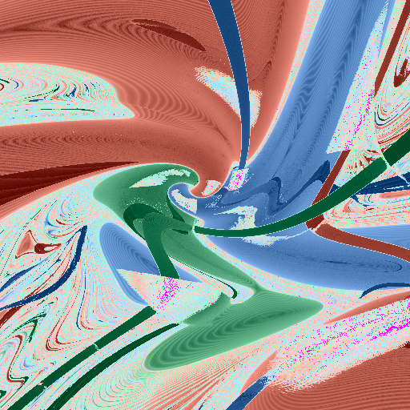
  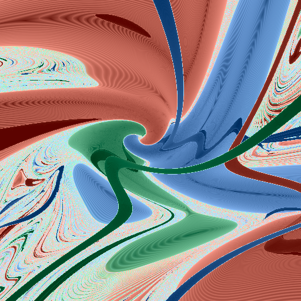
</p>

<p align="center"><i>
<code>config_stability</code> before and after the step-control work, same integrator (AZ), same
slice, same colour window. Left: pale wedges with straight edges severing the ribbons, magenta
speckle inside them. Right: continuous ribbons and neither.
</i></p>

Large pale wedges with straight edges, cutting across the ribbon structure. Straight edges in a
chart plane suggested a discrete boundary in the initial conditions, and a good deal of effort went
into the initial-condition layer looking for one — the reference-body partition *is* a six-sector
pinwheel with straight edges, so the hypothesis was not unreasonable. It was wrong: rendering that
partition showed it sits somewhere else entirely.

The wedges are the **predictive step limit alone**. Ablated one fix at a time on `config_stability`
at 512²:

| arm | non-finite | wedge density |
|---|---|---|
| none | 1153 | 0.0026 |
| `dtau` only | 32 | 0.0026 |
| clamp only | **1531** | 0.0024 |
| limit only | **0** | **0.0001** |
| all three | 0 | 0.0001 |

Three separable results in one table. The `dτ` fix removes the *magenta* and leaves the wedges
untouched — **two artefacts, never one defect**. The clamp *alone* makes non-finite worse, and is
unremovable regardless because it carries the convergence order. And `limit_only` reproduces `all` on
every column.

Post-fix the slice is integrator-insensitive at the median: Heggie, logH and **plain RK4 with no
regularisation at all** are indistinguishable from fixed AZ at 8 bits (`chord p50` ≈ 1e-6), though
all 9216 pixels move and `chord max` reaches 1.907 of a possible 2.0. Two nulls were read as broken
harnesses before that was measured.
</details>

<details>
<summary><b>A setting that was correct where it was born and silent where it spread</b></summary>

`refine_flagged` — the repair pass that re-integrates flagged pixels at finer `η` — was set to
`false` in an experiment harness with a rationale that still stands: experiments must characterise
the *unrepaired* kernel. The same commit wrote down the invariant, *"the render harnesses have it
ON"*.

Over six days the line was copied into 62 files, including every render harness, with no commit
message arguing for it, while `results/README.md` went on asserting the opposite. Measured on one
slice: `error_ratio` p99 **1.039e10 → 35.6**, drift max **1.97e12 → 6.74e-2**, non-finite
**30109 → 0**, with 11.1% of the slice re-integrated.

The median was blind to it — slice-wide drift p50 moved `4.251e-7 → 2.560e-7`, essentially nothing —
while p99 moved eight orders. A render checked on a median would have passed.

This has a sibling: `k_frac = 1.0` shipped as the scheduler default, which takes the top 100% of the
ranked frontier. The ranking ran and changed nothing, so 69 committed dumps were the uniform-mode
control with new columns attached.

**The failure in both cases is not the choice; it is that nothing recorded the choice.** The fix is
not the instance — it is the column. `EnsembleCfg::production` is now the one literal, the override
set is *derived by diffing* so a config declares itself however it was built, and a sidecar goes
beside every panel.
</details>

<details>
<summary><b>An orientation flip, and the guard that caught its own fixture</b></summary>

The adaptive render, the wireframe and the tree overlay flipped the vertical axis; every uniform
panel wrote the other order. An adaptive panel was a vertical mirror of the uniform panel beside it
for an entire build. A wrong flip is silent and reads as physics.

Slice order — row 0 is minimum `y` — is the single convention now, pinned by a bitwise test that also
asserts the *mirrored* image does **not** match, since an equality assertion alone passes on a
symmetric fixture.

The same test found a second thing on its first run: its probe used the root centre, which at level 2
is a cell *corner*, and the half-cell guard refused it. Correctly. A quad centre sits at `(2i+1)h`, so
dividing by the cell width `2h` gives `i + 0.5` and `.round()` lands on `i + 1` — mapping every quad
to its neighbour and scoring a perfectly coherent leaf set belonging to a *shifted* tree.
</details>

<details>
<summary><b>A statistic that reports maximum confidence when it knows least</b></summary>

Several, and they share a shape.

A **collapsed decode** — identical initial conditions across a footprint — gives `ensemble_spread`
exactly zero, which reads as *perfectly resolved* and stops the descent with a small tidy tree built
from nothing.

A **starved footprint**, every copy stopped early by the step budget, reads `error_ratio` at exactly
`1.0000` — its *converged* value — because every copy stopped at the same point and so agrees
perfectly. The statistic whose job is to say *this pixel is not data* reports the ideal. Measured with
all 512 copies flagged unusable, `ensemble_spread` was finite on every one and 5.6× *smaller* than the
healthy value: a truncated state is a perfectly good number, it is simply not the number the statistic
claims.

**Terminal-outcome purity** reads pure under lockstep, because early in a march nothing has terminated
and every copy agrees — maximum confidence at exactly the playhead where least is known. That is why
`spread_event` is over the *event class* — which pair is currently the tightest binary, evaluated at
every boundary — and not the terminal outcome.

The transferable test: **ask what the statistic would say about a system nothing is known about. If
the answer is "confident", it is wrong.**
</details>

<details>
<summary><b>Silent discards, in three classes, only one of which was a bug</b></summary>

Every `filter(is_finite)` in the codebase was read — 26 sites — after one was found dropping
undetermined copies from a reduction. They fall in three classes, and a blanket repair breaks two of
them:

- **(A) a reduction feeding a number** — `energy_drift_max`, `dt_max`, `ab_min`, `error_ratio_max`.
  The bug. All six now report undetermined.
- **(B) a ramp or axis window** — correct, because the non-finite set is painted separately rather
  than mixed into the ramp.
- **(C) a guard that declines to compute** — correct; `+inf` there is how *not in force* is spelled.

**The direction of the repair differs by reduction.** A max takes `+inf`, the absorbing element. A min
takes `NaN`, because there is no safe saturating value — `ab_min` returning `+inf` would read as *the
bodies never came close*. `dt_max` was the sharpest case: it folded from `0.0`, so a pixel whose every
copy was unusable reported *the largest step it took was zero* — from the diagnostic built to catch a
step of `2.209e128`. It sat eight lines below the field that was fixed and survived a full corpus
regeneration and a passing suite, because the test checked one field.

And a fix at one layer can degrade a bug at the layer above: once a truncated pixel became `+inf`, the
scheduler's own filter dropped it entirely, and a quad whose footprints were *all* undetermined folded
to `0.0` — perfectly clean.
</details>

<details>
<summary><b>The corpus that outlived the kernel</b></summary>

Nine result directories — 1009 files — predate every integrator fix. The `dτ` fix alone flipped
348,314 of 1,048,576 outcome labels on one slice.

What survives is the **arithmetic**: the accounting identity, `dp_optimal` as the ceiling, breadth-first
as the baseline, nested split sets, the four stop reasons. What does not is **every field-conditional
number**: all `error(B)` curves, every knob sweep, the regional spread medians, the mask saturation
fractions.

They are kept as the *before*, with the statement at the head of `results/README.md` rather than left
to be discovered. Related, and recorded rather than fixed by rewriting history: a render was once
committed in a commit whose code did not produce it, so a reader would have attributed a 17× file-size
change to an unrelated feature. **Commit renders in the same commit as the code that made them, or name
the commit in the filename.**
</details>

---

## 10. Running it

```bash
cargo build --release
cargo run --release --bin prin -- --region near-field --size 256 --out out
```

Writes `out.raw` — the product, every per-pixel field — plus `out_outcome.png` and `out_spread.png`.
`--help` lists the rest; the flags that change *what is measured* rather than how much are
`--precision f32`, `--shared-reference`, `--r-coll`, `--escape-rule`, `--dtau-mode` and `--no-refine`.

Note that `--size` drives the image **and** the per-pixel dump, and they want opposite sizes: the
images want 1024², the raw dumps are documented at 64² and at 1024² are 320 MB per region. Run it
twice.

```bash
cargo test --release                      # invariants and the acceptance suite
cargo test --release -- --ignored         # plus the NumPy cross-check (needs python3 + numpy)
```

Every measurement has a harness under `examples/` that prints its own raw table, and every committed
artefact in `results/` carries a `.cfg.txt` sidecar naming the exact kernel that produced it —
derived by diffing against the production config, so a config declares itself however it was built.

<details>
<summary><b>Layout</b></summary>

| path | contents |
|---|---|
| `src/` | the kernel — integrators, ensemble, scheduler, colouring, output |
| `examples/` | one harness per measurement; each prints its own raw table |
| `results/` | committed panels, dumps and captured output, each with a provenance sidecar |
| `docs/` | the brief, the results tables, the working notes; `docs/contracts/` holds the GLSL reference's own contract documents |
| `reference/` | the validated NumPy implementation. Port it; do not re-derive the algebra |
| `tools/` | the cross-check harness, corpus verification, format conversion |
</details>

---

## The habit worth stealing

> **A test that cannot fail is indistinguishable from a test that passes.**

Ask what would have to be true for the test to fire. A label-flip count of zero where every pixel
collides anyway is saturated, not clean. An invariance test at a horizon where nothing has terminated
is measuring its own arithmetic. An accounting identity that telescopes for *any* ranking — random
numbers included — reports PASS and means nothing; it was proposed here as the fix.

Two corollaries, both earned:

**Never conclude "no effect" from an aggregate without the per-pixel distribution.** Four sites here,
one of them inside the run written to *confirm* the prediction — a median of exactly `0.000` while 37%
of a million pixels moved, the worst by a third of the shape sphere's diameter. And the same
measurement on a coarse grid understated the maximum eightfold.

**A control arm is the part that keeps working.** Across this project the thing that caught the error
was almost never the property under test — it was the arm asserting the test had a subject: that the
flag was not inert, that the fixture still exercised the mechanism, that the two sides being compared
were not both dead.
