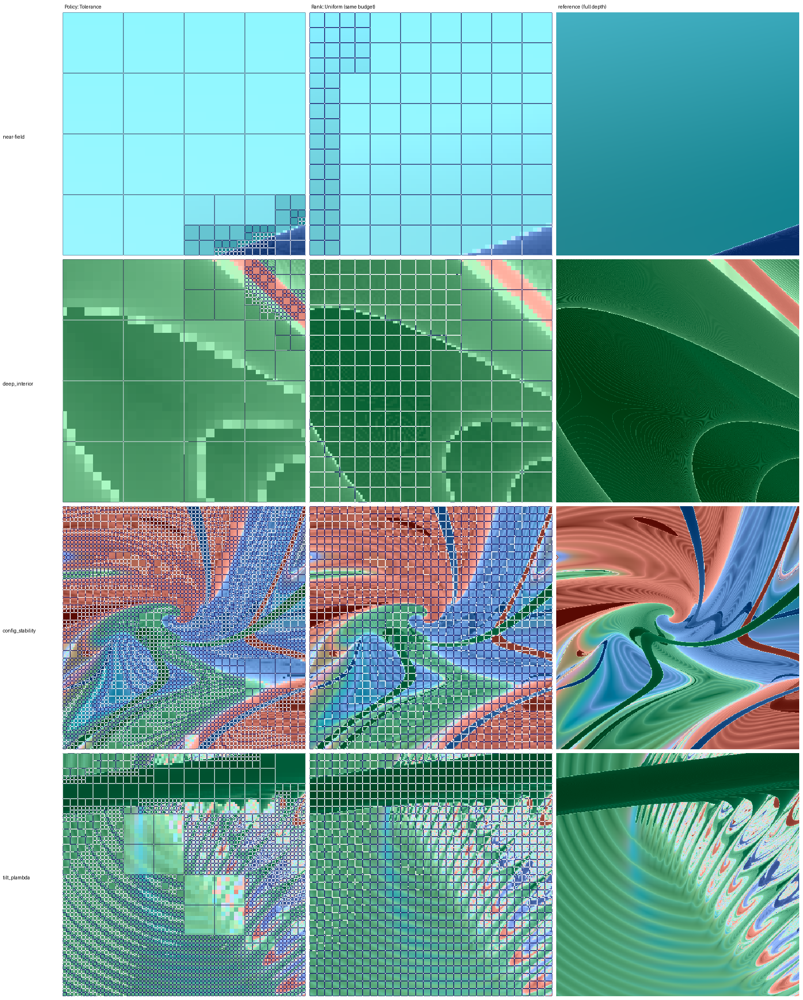

# Does the tolerance policy's saving generalise?

**Question, asked before the implementation plan is rewritten around it.** `Policy::Tolerance`
reaches zero unresolved on `near-field` at 137 quads against uniform's 5449 and on `deep interior`
at 329 against 5377 — 39.8x and 16.3x, recorded in `FINDINGS.md` §5.2. The frame-budget case in the
plan rests on savings of that order holding on the slices that will actually ship. Both of those
regions are Burrau at `t = 13`; neither is a latent chart, neither is tilted, and both are at the
one horizon.

**The prediction, stated first.** *The saving falls with horizon and is smallest on
`config_stability`, but stays above 5x at production settings. If it drops below ~2x anywhere that
matters, adaptive refinement stops being the thing that makes the frame budget work and the plan
needs a different answer.*

**The answer: it does not generalise, and there are two unrelated reasons a single ratio hides.**

- **On the two sea charts there is nothing to find, for any scheduler.** `config_stability` and
  `tilt_plambda` have a ceiling of **1.08-1.44x** over breadth-first in all 24 fixed-target cells
  measured. The policy sits close to that ceiling; the ceiling is breadth-first. `config_stability`
  is *below* uniform at every horizon.
- **On the Burrau regions the headroom is real (2.3-58.8x) and the production defaults throw it
  away by `t = 50`.** `near-field` collapses to a 21-quad bootstrap tree with 93% of its frame
  resolvable, because `alpha_area` returns **exactly 0.0000** on a near-empty mask. With
  `alpha_lo = 0` the same cell reaches **error 0.00000 at 1.03x of the exact optimum**.

Two of the four targets — the two that most resemble what the product would open — sit under the
2x line. The prediction's other half, *"the saving falls with horizon"*, is **a property of the
defaults and not of the field**: measured at a fixed error target the available saving does not
fall with horizon, and on Burrau it rises. §8.

---

## 1. What is measured, and how it differs from the published figures

Each cell runs one live descent under `Policy::Tolerance` against a committed footprint cache
(`levels = 6`, `N = 8`, `res = 512`), and scores three leaf sets on the same cache:

| symbol | meaning |
|---|---|
| `quads` | quads the tolerance descent ever computed — `SchedStats::quads_computed`, so deferred and merged work is charged, not just the resident tree |
| `uni` | the budget `Rank::Uniform` needs to reach **the tolerance tree's own error** |
| `dp` | the budget `Cache::dp_optimal` needs to reach that same error — the exact minimum over all tree-shaped leaf sets |

and from them three ratios:

```
    tol/u  = uni / quads      how much this policy saves against breadth-first   (>1 = adaptive wins)
    dp/u   = uni / dp         how much saving the FIELD offers to any policy     (the ceiling)
    tol/dp = quads / dp       how much of it this policy captures                (1.0 = optimal)
```

**`tol/u` alone cannot answer the question, and that is the central methodological point here.** A
low `tol/u` has two completely different causes — a field with nothing to find, and a policy failing
to find it — and only `dp/u` separates them. Both occur below, on the same chart at two tolerances.

**This is not the same statistic as `FINDINGS.md` §5.2.** Those figures are quads to reach **zero
unresolved**; these are quads to reach **the tree's own final error**, whatever that is. The two
agree where the tree does reach zero — `near-field` reads 37.5x here against the published 39.8x,
the residual difference being `alpha_lo = 0.005` now against `0.2` then — and diverge by threefold
where it does not: `deep interior` reads 5.28x here against the published 16.3x. Neither is wrong;
they answer different questions, and the frame-budget question is this one, because a live renderer
spends a budget and displays whatever it got, rather than running until a criterion is satisfied.

**The pipeline reconciles against the published figure independently.** One cell here does reach
zero error — `near-field` at `eps = 1e-3` with `tau` calibrated — and it reports uniform needing
**5449** quads, which is exactly the number §5.2 quotes. That is the same reference tree reached by
a different route, so the two measurements are commensurable even where their headline ratios are
not.

### The four targets

| target | what it is | why it is here |
|---|---|---|
| `near-field` | Burrau, `Chart::BodyPlane`, `half = 0.05` | one of the two regions the published saving was measured on |
| `deep interior` | Burrau, `Chart::BodyPlane`, `half = 0.05` | the other one |
| `config_stability` | `Chart::Latent`, a configuration slice | the slice the render corpus is built on — sea-dominated |
| `tilt_plambda` | `Chart::Latent`, supplied ten-slot UI config, in-plane tilt, unequal masses `(0.35333, 0.27523, 0.37144)` | the first tilted slice, and the closest thing here to a slice the product would actually open |

All four at `levels = 6`, `N = 8`, `res = 512`, `k_frac = 0.25`, `alpha_lo = 0.005`, camera on,
`refine_flagged` off (the unrepaired kernel — the repair pass is batch-only and has no
live-playhead analogue, so a frame-budget measurement must not be taken through it).

### Two thresholds that are not the same threshold

The descent's `tau` tests **within-footprint spread** — do this footprint's `E+1` copies agree?
The metric's `eps` tests the **displayed value against the fully-refined reference** — is this
texel's payload right? `spread_shape` is a mean deviation from the copies' centroid, halved, so a
footprint reading `spread ≤ tau` can hold a pixel whose chord to the texel exceeds `tau` by a
factor near three. `examples/payload_metric.rs` carries that as a comment and an argument, saying
the factor "is a calibration to measure, not a constant to assume".

Every cell below sets `tau = eps` unless a `tau` column says otherwise. **That is the
mis-calibrated setting**, and it is measured against `tau = eps/3.3` rather than assumed harmless.

### The accounting is symmetric, which is the obvious objection and it does not bite

`quads` is `SchedStats::quads_computed`, every quad the descent touched. `metric::replay_ordered`
starts `spent = 1` for the root and adds **4 per split**, so its budget counts internal quads and
leaves alike (`src/metric.rs:1078,1136`). Both sides count computed quads, not displayed leaves,
so the ratios need no correction for tree overhead.

### The horizon ladder is one discretisation, not three

`dtau = eta*dt_left/(A0*B0)`, so holding `n_sync` fixed while `t_max` varies changes the step
size and the rows stop being one trajectory at different playheads. Every cache is built with
`n_sync` scaled to its horizon — **32, 57, 123** at `t_max` 13, 23, 50 — from the build headers.

### `ScreenFloor` and `MaxLevel` coincide at this fixture, so the veto costs nothing here

At `levels = 6`, `res = 512`, `N = 8` a quad's texels fall below display resolution at exactly the
depth the cache runs out. Running with the camera off is therefore a **pure relabel** —
`near-field` and `deep interior` give identical trees, identical errors and identical ratios with
`screen_floor:23`/`screen_floor:68` reading `max_level:23`/`max_level:68` (the `cam 0` rows). So
"veto-bound" and "depth-capped" are the same statement here, and no saving quoted below is a fact
about the viewport.

**What that does mean is that the deepest trees are capped**, and it bounds what these numbers can
say. `config_stability` at `eps = 1e-2` computes 4729 quads against a complete level-6 tree of
5461, with 64% of its leaves stopped by the cap: both it and uniform are near-complete trees, which
is *why* the ratio is 1.00x. Whether adaptivity would separate them given more levels is not
measured here and the cache cannot answer it.

---

## 2. The headline: `t = 13`, `eps = 1e-2`, the production tolerance

| region | quads | uni | dp | **tol/u** | **dp/u** | tol/dp | error | sea | undet |
|---|---|---|---|---|---|---|---|---|---|
| `near-field` | 125 | 4689 | 77 | **37.51x** | 60.90x | 1.62x | 0.00028 | 0.0005 | 0.0000 |
| `deep interior` | 225 | 1189 | 65 | **5.28x** | 18.29x | 3.46x | 0.00286 | 0.0025 | 0.0000 |
| `config_stability` | 4729 | 4741 | 3885 | **1.00x** | 1.22x | 1.22x | 0.05819 | 0.2377 | 0.0000 |
| `tilt_plambda` | 3545 | 4121 | 2609 | **1.16x** | 1.58x | 1.36x | 0.15773 | 0.2847 | 0.0000 |

Stop breakdowns, which no leaf count may be quoted without:

```
    near-field         floor:3    keep:68    screen_floor:23      (94 leaves)
    deep interior      floor:8    keep:93    screen_floor:68      (169)
    config_stability   floor:211  keep:1062  screen_floor:2274    (3547)
    tilt_plambda       floor:224  keep:1347  screen_floor:1088    (2659)
```

**The prediction was wrong in both halves.** It said the saving would be smallest on
`config_stability` but stay above 5x; it is smallest on `config_stability` and reads **1.00x**, and
the tilted slice reads 1.16x. Two of the four targets — the two that most resemble what the product
would open — are below the 2x line named as the point where the plan needs a different answer.

### The saving column alone would have got the reason wrong

`tol/u` conflates two unrelated failures, and both are present in this measurement:

- **`config_stability` at `eps = 1e-2`: the field offers nothing.** `dp/u = 1.22x` — the *exact
  optimum over all tree-shaped leaf sets* is within 22% of breadth-first. The policy captures
  essentially all of it (`tol/dp = 1.22x`, and 1.00 / 1.22 means it lands on uniform). **There is no
  scheduler that does better here**, so this is not a criterion defect and no criterion change
  addresses it.
- **`config_stability` at `eps = 1e-1`: the field offers 2.23x and the policy delivers 0.75x** —
  *worse than breadth-first*, at `tol/dp = 2.99x`. That one is a policy failure.

Same chart, one decade of tolerance apart, opposite diagnoses. A table carrying only `tol/u` would
have shown 1.00x and 0.75x and suggested the second was merely a little worse than the first.

### Why: the saving needs structure to be LOCALISED, and this reproduces a standing result

`FINDINGS.md` records, from the OKLab-metric era, that the headroom over breadth-first rises with
structure and collapses where structure is everywhere — *"where nothing varies there is nothing to
rank; where everything varies the budget must go everywhere and breadth-first is right again."*
That was measured under a metric later shown to be the reason the alpha policy survived. **It
reproduces here under the payload metric, on different charts, with the exact optimum as the
ceiling rather than a greedy reference.**

The panels say it more directly than the table. In `near-field` and `deep interior` the tolerance
tree is one or two levels over almost the whole frame and cuts finely along a single corner; in
`config_stability` it is at maximum depth essentially everywhere. At equal budget, breadth-first
spends its level-3 allocation in raster order down the left edge, where the field is flat.



*Rows: `near-field`, `deep interior`, `config_stability`, `tilt_plambda`. Columns: the tolerance
tree's wireframe; `Rank::Uniform` at the **same quad count**; the full-depth reference. Zero
`DEBUG_NAN` pixels in all twelve panels — counted and printed per panel, not assumed.*

---

## 3. The calibration control: is the headline an artefact of `tau = eps`?

**No.** Re-running at `tau = eps/3.3` — the factor the harness names — at `eps = 1e-2`:

| region | quads (`tau=eps`) | error | tol/u | quads (`tau=eps/3.3`) | error | tol/u |
|---|---|---|---|---|---|---|
| `near-field` | 125 | 0.00028 | **37.51x** | 125 | 0.00028 | **37.51x** |
| `deep interior` | 225 | 0.00286 | **5.28x** | 225 | 0.00286 | **5.28x** |
| `config_stability` | 4729 | 0.05819 | **1.00x** | 4373 | 0.13565 | **0.92x** |
| `tilt_plambda` | 3545 | 0.15773 | **1.16x** | 3749 | 0.15549 | **1.10x** |

The two Burrau rows are **bitwise identical**, not merely close — same quad count, same stop
breakdown, same error to five digits.

So the Burrau rows are not threshold artefacts, and both sea charts move by under 10% in the ratio
and stay at ~1x — `config_stability` moving to **0.92x**, below breadth-first. **The conclusion is
robust to the one threshold that could have flattered it, and the calibrated setting is the worse
of the two on both sea charts.**

### What the tolerance does to the area floor's exponent, and what it does not

Tightening `tau` marks more footprints unresolved, so the unresolved set gets **fatter** — its box
dimension rises toward 2 — and `alpha_area = 2 - d` falls toward the floor. That is consistent and
measured on both sea charts:

```
    alpha_area p50, all judged quads      tau = eps    tau = eps/3.3
      config_stability                     +0.5774       +0.1763      (box dim 1.42 -> 1.82)
      tilt_plambda                         +0.1839       +0.0757      (box dim 1.82 -> 1.92)
```

**The consequence for tree size is not consistent, and the first reading of this was wrong.**
`config_stability` computed *fewer* quads under the tighter tolerance (4729 -> 4373) and grew
leaves at levels 3 and 4 where the looser run had none — asking for more accuracy bought a coarser
tree, 2.3x the error, and a ratio below breadth-first. On `tilt_plambda` the same exponent shift accompanied a tree 6% *larger*
(3545 -> 3749) at fractionally lower error. The budget bound in neither case (10922 against 4373
and 3749).

So the exponent moves the same way on both and the tree size moves in opposite directions: **the
exponent shift does not determine the tree size**, and the coarsening seen on `config_stability` is
that chart's behaviour rather than a general mechanism. Stated as measured; the stop-composition
also moves sharply (`config_stability` `keep` 1062 -> 343 while `screen_floor` 2274 -> 2767), so
more than one thing is changing at once and this measurement does not separate them.

---

## 4. The `eps` ladder, and why it needs the calibrated `tau` to mean anything

Burrau regions, complete at all three tolerances and both threshold settings:

| region | eps | tau | quads | uni | dp | **tol/u** | dp/u | tol/dp | error |
|---|---|---|---|---|---|---|---|---|---|
| `near-field` | 1e-1 | 1e-1 | 125 | 4689 | 77 | 37.51x | 60.90x | 1.62x | 0.00028 |
| `near-field` | 1e-2 | 1e-2 | 125 | 4689 | 77 | 37.51x | 60.90x | 1.62x | 0.00028 |
| `near-field` | 1e-3 | 1e-3 | 137 | 41 | 37 | **0.30x** | 1.11x | 3.70x | 0.30436 |
| `near-field` | 1e-3 | 3e-4 | 357 | 5449 | 329 | **15.26x** | 16.56x | **1.09x** | **0.00000** |
| `deep interior` | 1e-1 | 1e-1 | 225 | 1317 | 89 | 5.85x | 14.80x | 2.53x | 0.00189 |
| `deep interior` | 1e-2 | 1e-2 | 225 | 1189 | 65 | 5.28x | 18.29x | 3.46x | 0.00286 |
| `deep interior` | 1e-3 | 1e-3 | 225 | 4185 | 93 | **18.60x** | 45.00x | 2.42x | 0.00644 |
| `deep interior` | 1e-3 | 3e-4 | 541 | 4185 | 93 | **7.74x** | 45.00x | 5.82x | 0.00644 |

### `near-field` at `eps = 1e-3` is 0.30x mis-calibrated and 15.26x calibrated

Same chart, same tolerance, same everything but the descent's threshold. At `tau = eps` the tree
stops at 137 quads reading `keep:77` — *the criterion calls the quads resolved* — while 30% of
pixels differ from the fully-refined reference. At `tau = eps/3.3` it reaches **error exactly
0.00000** at 357 quads, within **1.09x of the exact optimum**.

That row alone would have been reported as a catastrophic failure of the policy at tight
tolerances. It is a threshold placement, and nothing else.

### But the same correction COSTS `deep interior` 2.4x for nothing

`deep interior` reaches error 0.00644 at **225** quads with `tau = eps` and at **541** with
`tau = eps/3.3` — the identical error for 2.4x the quads, and 18.60x drops to 7.74x. The loose
threshold was already sufficient there and the tight one over-refines.

**So `tau = eps` under-refines `near-field` and `tau = eps/3.3` over-refines `deep interior`, at
the same `eps`.** No fixed factor between the two thresholds is right on both charts — which is
what the harness comment means by "a calibration to measure, not a constant to assume", and is the
standing *a fixed threshold fails on BOTH sides* result at a new pair of quantities.

### The sea charts: the tolerance is nearly inert, and the calibration with it

| region | eps | tau | quads | uni | dp | **tol/u** | dp/u | tol/dp | error | sea |
|---|---|---|---|---|---|---|---|---|---|---|
| `config_stability` | 1e-1 | 1e-1 | 2285 | 1709 | 765 | **0.75x** | 2.23x | 2.99x | 0.06086 | 0.0494 |
| `config_stability` | 1e-2 | 1e-2 | 4729 | 4741 | 3885 | **1.00x** | 1.22x | 1.22x | 0.05819 | 0.2377 |
| `config_stability` | 1e-2 | 3e-3 | 4373 | 4009 | 3021 | **0.92x** | 1.33x | 1.45x | 0.13565 | 0.2377 |
| `config_stability` | 1e-3 | 1e-3 | 4021 | 3885 | 3505 | **0.97x** | 1.11x | 1.15x | 0.24201 | 0.7840 |
| `config_stability` | 1e-3 | 3e-4 | 3933 | 3773 | 3401 | **0.96x** | 1.11x | 1.16x | 0.25921 | 0.7840 |
| `tilt_plambda` | 1e-1 | 1e-1 | 1845 | 4237 | 1017 | **2.30x** | 4.17x | 1.81x | 0.08406 | 0.1694 |
| `tilt_plambda` | 1e-2 | 1e-2 | 3545 | 4121 | 2609 | **1.16x** | 1.58x | 1.36x | 0.15773 | 0.2847 |
| `tilt_plambda` | 1e-2 | 3e-3 | 3749 | 4133 | 2629 | **1.10x** | 1.57x | 1.43x | 0.15549 | 0.2847 |
| `tilt_plambda` | 1e-3 | 1e-3 | 3765 | 4213 | 3437 | **1.12x** | 1.23x | 1.10x | 0.17437 | 0.7251 |
| `tilt_plambda` | 1e-3 | 3e-4 | 3773 | 4185 | 3433 | **1.11x** | 1.22x | 1.10x | 0.17546 | 0.7251 |

Nothing here reaches 2.30x except the coarsest `config_stability`-adjacent rung on `tilt_plambda`,
and `config_stability` is **at or below breadth-first at every tolerance measured** — 0.75x, 1.00x,
0.97x, and 0.92x / 0.96x calibrated. The calibration moves these rows by at most 8% and never
across the 2x line.

**Where the tolerance does bite it is by growing the sea, not by buying resolution.** Tightening
`eps` two decades takes `config_stability` from 5% sea to 78% and its *ceiling* from 2.23x to
1.11x. The policy is not being outperformed there — `tol/dp` is 1.10-1.45x on eight of these ten
rows, so it is close to the exact optimum. **The optimum is close to breadth-first.**

**Consequence for anything downstream: `eps` is not a single quality knob.** It sets the metric,
and a second threshold has to be placed inside each chart's own spread distribution for the descent
to act on it. A tier table keyed on `eps` alone would be keyed on half a setting.

---

## 5. What predicts the headroom: the sea, with a stated limit

`sea_fraction(eps)` is the fraction of the frame whose **deepest-level** footprint still has
`ensemble_spread > eps` — the part no depth resolves, computed from the cache before any descent
runs (`src/metric.rs:739`; a `NaN` spread counts as sea, the no-discard convention).

| region | eps | tau | sea | **dp/u** (the ceiling) | tol/u |
|---|---|---|---|---|---|
| `near-field` | 1e-1 | 1e-1 | 0.0005 | 60.90x | 37.51x |
| `near-field` | 1e-2 | 1e-2 | 0.0005 | 60.90x | 37.51x |
| `near-field` | 1e-3 | 3e-4 | 0.0005 | 16.56x | 15.26x |
| `deep interior` | 1e-1 | 1e-1 | 0.0022 | 14.80x | 5.85x |
| `deep interior` | 1e-2 | 1e-2 | 0.0025 | 18.29x | 5.28x |
| `deep interior` | 1e-3 | 3e-4 | 0.0041 | 45.00x | 7.74x |
| `tilt_plambda` | 1e-1 | 1e-1 | 0.1694 | 4.17x | 2.30x |
| `tilt_plambda` | 1e-2 | 1e-2 | 0.2847 | 1.58x | 1.16x |
| `tilt_plambda` | 1e-3 | 3e-4 | 0.7251 | 1.22x | 1.11x |
| `config_stability` | 1e-1 | 1e-1 | 0.0494 | 2.23x | 0.75x |
| `config_stability` | 1e-2 | 1e-2 | 0.2377 | 1.22x | 1.00x |
| `config_stability` | 1e-3 | 3e-4 | 0.7840 | 1.11x | 0.96x |

The `1e-3` rows take the **calibrated** `tau`, per §4 — at `tau = eps` that rung measures the
threshold mismatch instead. `dp/u` is a property of the field and the error target, not of the
descent, so it is unaffected by which `tau` produced the tree; `tol/u` is not, and the column says
which setting it was measured at.

**Two regimes, separated by orders of magnitude.** Where the sea is under ~0.005 the ceiling is
15-60x; where it is over ~0.05 the ceiling is 1.1-4.2x. Nothing lands between.

**Within a chart it is monotone**: `config_stability` runs sea 0.0494 -> 0.2377 -> 0.7840 as `eps`
tightens by two decades, and its ceiling collapses 2.23x -> 1.22x -> 1.11x; `tilt_plambda` runs
0.1694 -> 0.2847 -> 0.7251 with 4.17x -> 1.58x -> 1.22x. At `eps = 1e-3` **both** sea charts are
over 72% sea with `alpha_area` p50 exactly **0.0000** — box dimension 2.0, the unresolved set
completely space-filling. There is nothing there to allocate around.

**Across charts it is not a function of the sea, and the obvious claim is refuted by the data in
its own table.** `config_stability` at sea 0.0494 has a ceiling of 2.23x while `tilt_plambda` at
sea 0.1694 has 4.17x — three times the sea, nearly twice the headroom. A monotone relation looked
clean over the first four cells measured and does not survive the fifth. **Sea fraction separates
the regimes; it does not order charts within one.**

---

## 6. `Decision::Undetermined` — the second budget line, which does not appear here

You named this as the thing most likely to break the result: a quad ending `Undetermined` needs
**finer `eta`**, not finer cells, so it is a second budget line that the quad ratios do not price.

**It reads `0.0000` in every cell of this measurement** — all four regions, three tolerances, both
threshold settings, `collapsed` likewise 0. So at these settings that budget line does not exist
and the ratios above are the whole cost.

**That is a fact about these four charts under the current kernel, and not a general claim.** The
guard fires: `results/charts` records `Decision::Undetermined` on 22 quads of `burrau_nu_k` and 23
of `latent_mixed_h3`, 45 of ~21,000. And it is *designed* to be inert where integration succeeds —
`scheduler::footprint_undetermined` keys on a non-finite `ensemble_spread`, an unusable copy, or a
non-finite `spread_shape`, none of which occur on these slices now that the step-control work has
landed (`PerStepInterval`, `clamp_final_step`, `StepLimit::Predictive`). Before that work,
`config_stability` at 1024² carried **30,109 non-finite pixels**.

So the correct reading is: **the integrator fixes are what make the second budget line absent
here**, and a chart that still integrates badly would reintroduce it. `burrau_nu_k` and
`latent_mixed_h3` are where to look for that, and they are not in this set.

---

## 7. The horizon: the defaults chosen at `t = 13` fail at `t = 50`

**Both defaults under test here — `tau = eps` and `alpha_lo = 0.005` — were chosen by measurement
at `t = 13`, and both break by `t = 50`.** The `tau` sweep is presented first because it is how the
failure was found; the area floor, second, is the cause.

### The ladder, at the production defaults

`eps = 1e-2`, `tau = eps`, `alpha_lo = 0.005`, camera on:

| region | t | quads | uni | dp | **tol/u** | dp/u | tol/dp | error | **sea** |
|---|---|---|---|---|---|---|---|---|---|
| `near-field` | 13 | 125 | 4689 | 77 | **37.51x** | 60.90x | 1.62x | 0.00028 | 0.0005 |
| `near-field` | 23 | 313 | 905 | 89 | **2.89x** | 10.17x | 3.52x | 0.00253 | 0.0017 |
| `near-field` | 50 | 21 | 21 | 13 | **1.00x** | 1.62x | 1.62x | 0.10328 | 0.0745 |
| `deep interior` | 13 | 225 | 1189 | 65 | **5.28x** | 18.29x | 3.46x | 0.00286 | 0.0025 |
| `deep interior` | 23 | 313 | 5109 | 197 | **16.32x** | 25.93x | 1.59x | 0.00056 | 0.0079 |
| `deep interior` | 50 | 309 | 5109 | 197 | **16.53x** | 25.93x | 1.57x | 0.00056 | 0.0078 |
| `config_stability` | 13 | 4729 | 4741 | 3885 | **1.00x** | 1.22x | 1.22x | 0.05819 | 0.2377 |
| `config_stability` | 23 | 3869 | 3713 | 2725 | **0.96x** | 1.36x | 1.42x | 0.15718 | 0.3270 |
| `config_stability` | 50 | 2301 | 1897 | 1273 | **0.82x** | 1.49x | 1.81x | 0.30788 | 0.3897 |
| `tilt_plambda` | 13 | 3545 | 4121 | 2609 | **1.16x** | 1.58x | 1.36x | 0.15773 | 0.2847 |
| `tilt_plambda` | 23 | 2941 | 3369 | 2257 | **1.15x** | 1.49x | 1.30x | 0.23985 | 0.3959 |
| `tilt_plambda` | 50 | 2349 | 2385 | 1693 | **1.02x** | 1.41x | 1.39x | 0.36047 | 0.5389 |

**`sea_fraction` rises with horizon on every chart** — 0.0005 -> 0.0017 -> 0.0745, 0.0025 -> 0.0079,
0.2377 -> 0.3270 -> 0.3897, 0.2847 -> 0.3959 -> 0.5389 — which is chaotic divergence putting more of
the frame beyond any depth, and it is the one monotone horizon trend here. The sea charts stay at or
below breadth-first at every horizon; `config_stability` **declines** 1.00x -> 0.96x -> 0.82x.

**`tol/u` is NOT a clean horizon trend, and must not be read as one.** Every cell is scored against
uniform's budget to reach *that tree's own error*, so a tree landing at a worse error automatically
gets a smaller ratio. `near-field` falls 37.51x -> 2.89x while its error worsens 9x; `deep interior`
*rises* 5.28x -> 16.32x while its error improves 5x. The ratio is the right operational question at
a fixed horizon — "at the quality this policy delivered, what would breadth-first have cost" — and
it mixes two things across horizons. **Read it with the error column visible.**

### The `tau` plateau, and the cliff at the fifth rung

`near-field`, `eps = 1e-2` throughout, sweeping the descent's threshold:

| t | tau | quads | depth | error | uni | **tol/u** | tol/dp |
|---|---|---|---|---|---|---|---|
| 13 | 1e-2 | 125 | 6 | 0.00028 | 4689 | **37.51x** | 1.62x |
| 13 | 3e-3 | 125 | 6 | 0.00028 | 4689 | **37.51x** | 1.62x |
| 23 | 1e-2 | 313 | 6 | 0.00253 | 905 | **2.89x** | 3.52x |
| 23 | 1e-3 | 509 | 6 | **0.00000** | 4941 | **9.71x** | 1.49x |
| 23 | 1e-4 | 1225 | 6 | 0.00000 | 4941 | 4.03x | 3.59x |
| 50 | 1e-2 | 21 | **2** | 0.10328 | 21 | **1.00x** | 1.62x |
| 50 | 3e-3 | 21 | 2 | 0.10328 | 21 | 1.00x | 1.62x |
| 50 | 1e-3 | 21 | 2 | 0.10328 | 21 | 1.00x | 1.62x |
| 50 | 3e-4 | 21 | 2 | 0.10328 | 21 | 1.00x | 1.62x |
| 50 | 1e-4 | 697 | 6 | 0.03910 | 2881 | **4.13x** | 2.09x |

**The `tau` that works falls by about a decade per horizon step**: `eps` at `t = 13` (bitwise inert
down to `eps/3.3`), `eps/10` at `t = 23`, `eps/100` at `t = 50`. At the
production default the `t = 50` tree stops at the **bootstrap** — 21 quads, depth 2, no split
anywhere — while `sea_fraction` is only 0.0745, so 93% of that frame is resolvable and is not
resolved.

The mechanism is the one already on record one level down: terminal states are absorbing, so as
termination saturates the copies come to agree, `spread_shape` collapses, and a fixed threshold
fires nowhere. *The treadmill does not happen; the opposite does.* This is that result reaching the
tolerance policy.

**Read the plateau, not one rung.** Four rungs across two decades give a bitwise identical tree and
the fifth changes everything. A two-rung sample would have reported either "`tau` is inert here" or
"`tau` fixes it", depending entirely on which two.

### And the cause is the area floor, on an arithmetic degeneracy

`near-field`, `t = 50`, `tau = 1e-2` — only `alpha_lo` moved:

| alpha_lo | quads | depth | stop | error | uni | **tol/u** | **tol/dp** |
|---|---|---|---|---|---|---|---|
| 0.005 (production) | 21 | 2 | `floor:4 keep:12` | 0.10328 | 21 | **1.00x** | 1.62x |
| 0 (the opt-in) | 829 | 6 | `keep:115 screen_floor:507` | **0.00000** | 4813 | **5.81x** | **1.03x** |

Opening the floor takes the same chart, same tolerance, same everything from a useless 21-quad tree
to **exactly zero error at 1.03x of the exact optimum** — and it beats the `tau = 1e-4` workaround
above on both axes (829 quads at error 0.00000 against 697 at 0.03910). **So the floor is the
binding constraint at `t = 50` and tightening `tau` is a partial workaround for it, not an
independent fix.**

The exponent says exactly why:

```
    t = 50, tau = 1e-2, alpha_lo = 0.005   alpha_area over judged quads:  n 3    p10 +0.0000  p50 +0.0000  p90 +0.0000
    t = 50, tau = 1e-2, alpha_lo = 0                                      n 199  p10 -0.0457  p50 +0.0000  p90 +0.9354
                                                                          (the floor acted on nothing)
```

**`alpha_area` is exactly `+0.0000` — not near zero, exactly — on every quad it judged.**
`alpha_area = log2(unresolved_area(coarse) / unresolved_area(children))`, so it is exactly zero
whenever the unresolved set is *the same size* at both levels. At `t = 50` the spread has collapsed
and almost nothing is unresolved, so the handful of unresolved footprints is identical at parent and
child, the ratio is exactly 1, and the exponent is exactly 0. Any **positive** `alpha_lo` floors on
that; `alpha_lo = 0` makes the test `0 < 0` false, which is why the opt-in works.

**The floor cannot distinguish a full mask from an empty one.** It was built for the case where the
unresolved set is space-filling — `d = 2`, `alpha_area = 0`, splitting genuinely buys nothing — and
a near-empty mask produces the identical reading. At `t = 50` `sea_fraction` is **0.0745**: 93% of
that frame is resolvable, and the floor declared it a sea on three measurements. This is the
standing *a full mask and an empty mask are the same threshold landing on either side of the
distribution*, now **inside `alpha_area` itself** rather than in the criteria that read the mask.

**A leaf-level stop count understates a floor enormously, and this is the measurement that shows
it.** Only **4** leaves read `floor` at the production setting. They sat at level 2, so each one
foreclosed a quarter of the frame: 4 leaves of 16 suppressed a descent that would have reached 829
quads at zero error. The standing rule is *never quote a leaf count without the stop-reason
breakdown*; this adds that **the breakdown itself needs weighting by the subtree each stop
forecloses**, or a decisive stop reads as a rounding error. `n 3` judged quads is the other tell —
the whole tree turned on three numbers.


---

## 8. The confound-free version: the ceiling at a FIXED target

Every `tol/u` above is scored at its own tree's error, so it cannot answer "does the horizon reduce
the available saving". `payload_metric replay` can: it runs **zero trajectories** and scores the
floor (`Rank::Uniform`) and the ceiling (`dp_optimal`) at the fixed targets `[0.05, 0.02, 0.01,
0.005]`, so `dp/u` there is a property of the field alone, comparable across horizons.

**dp/u at target `<= 0.005`** (the tightest the harness scores):

| region | t = 13 | t = 23 | t = 50 |
|---|---|---|---|
| `near-field` | 2.33x | 5.65x | **6.58x** |
| `deep interior` | 8.46x | **58.80x** | 20.32x |
| `config_stability` | 1.08x | 1.08x | 1.19x |
| `tilt_plambda` | 1.25x | 1.21x | 1.22x |

**The available saving does not fall with the horizon. On the Burrau regions it rises.** So *"the
saving falls with horizon"* — half of the prediction, and what `tol/u` appeared to show — is a
property of the **policy at fixed defaults**, not of the field. Corrected by the measurement built
to remove the confound.

**And the two regimes are a property of the chart, at every horizon and every target.** The sea
charts sit at **1.08-1.44x** in all 24 of their cells; the Burrau regions reach 2.33-58.80x. Nothing
in the middle, and the horizon does not move a chart between regimes.

---

## 9. The answer

**The saving does not generalise, and there are two separate reasons that a single ratio hides.**

**On the sea charts there is nothing to find, at any horizon, any tolerance, and for any
scheduler.** `config_stability` and `tilt_plambda` have a ceiling of 1.08-1.44x over breadth-first
in every one of the 24 fixed-target cells measured. The tolerance policy is not underperforming
there — it sits at 1.10-1.45x of the exact optimum on most rows. **The optimum is breadth-first.**
Both charts sit at or below 1.16x measured, and `config_stability` is *below* uniform at every
horizon. Two of the four targets, and the two that most resemble what the product would open, are
under the 2x line named as the point where the plan needs a different answer.

**On the Burrau regions the headroom is real (2.3-58.8x) and the defaults throw it away by
`t = 50`.** `near-field` collapses to a 21-quad bootstrap tree at the production settings while 93%
of its frame is resolvable, because `alpha_area` returns **exactly 0.0000** on a near-empty mask and
any positive `alpha_lo` floors on it. With `alpha_lo = 0` the same cell reaches **error 0.00000 at
1.03x of the exact optimum**.

### What follows

1. **Do not key a cost model on a single saving factor.** It ranges 0.75x to 37.5x across four
   charts at one horizon, and the spread is the field's, not the policy's.
2. **`sea_fraction` is the predictor, it is computable before any descent, and it is cheap.** Under
   ~0.005 the ceiling is 15-60x; over ~0.05 it is 1.1-4.2x. It does not order charts *within* a
   regime — `config_stability` at 0.0494 has less headroom than `tilt_plambda` at 0.1694 — but the
   regime is what decides whether to run adaptively at all. It currently needs a full cache; a cheap
   estimator sampling the finest level on a sparse subset is **unbuilt** and is the concrete next
   step.
3. **`alpha_area` needs to separate an empty mask from a full one.** Both read exactly 0.0000 today.
   That is a bug in the floor, not a tuning question, and it is what costs `near-field` its `t = 50`
   descent.
4. **`tau` is a second threshold and cannot be derived from `eps` by a constant.** The working value
   ran `eps`, `eps/10`, `eps/100` across `t = 13, 23, 50` on one chart, and `eps/3.3` over-refines
   `deep interior` at `t = 13` by 2.4x for no error gain.

### What this measurement does not say

- **Nothing about depth beyond level 6.** Every tree here is capped, and on the sea charts both
  arms are near-complete level-6 trees. Whether more levels separate them is not measurable from
  these caches.
- **Nothing about `Undetermined` as a cost.** It reads 0.0000 in every cell *because the
  step-control work landed*; a chart that still integrates badly reintroduces it.
- **Nothing about the live playhead.** These are static descents. The march trails the static tree
  through the no-gain merges, measured elsewhere, and that cost is not in these ratios.


## 10. Reproduction

Caches (one per region and horizon; ~40 MB each, 194-710 s to build, **at most two concurrently** —
the footprint store is the memory risk, not the raster):

```sh
cargo build --release --example payload_metric
for t in 13 23 50; do
  for r in near-field "deep interior" config_stability tilt_plambda; do
    ./target/release/examples/payload_metric build "$r" 6 8 0.01 "$t" <SCRATCH_ROOT>
  done
done
```

One cell — `live <cache> <policy> <eps> <k_frac> <root> <stationary> <tau> <alpha_lo> <agreement>
<dim_floor> <ttl> <camera> [<panel_root>]`:

```sh
./target/release/examples/payload_metric live <cache> tolerance 0.01 0.25 <SCRATCH_ROOT> \
    0 0.01 0.005 1 1 -1 1  <SCRATCH_ROOT>/panels
```

Argument 8 is `tau` and argument 13 the camera; **argument 14 (the panel root) is new in this
commit** and is what writes the three wireframe panels. Omit it and no image is written, so every
cell measured before it stays valid.

`near-field` and `deep interior` read their caches from the committed `results/payload/`; the other
ten were built under `<SCRATCH_ROOT>`. **No validation run writes into `results/`** — the panels
and the document were copied in deliberately, as the artefacts of this measurement.

### Two things that will bite a re-run

**A cell killed part-way leaves a 492-byte partial**, and every `[[ -s ... ]]` skip test reads that
as finished. `validate.sh` in the batch checks each cell carries its `indicator/eps=` line and
deletes those that do not; it was run before the tables above were read.

**Three concurrent cells exhaust memory on an 11-core machine** — each holds a full footprint
cache, and the OS reaped background tasks while three were live. The batch was serialised by
`SIGSTOP`/`SIGCONT` rather than by killing, so no partial cell was lost.
